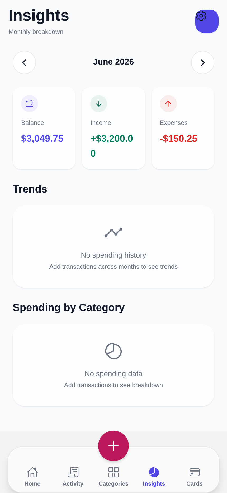
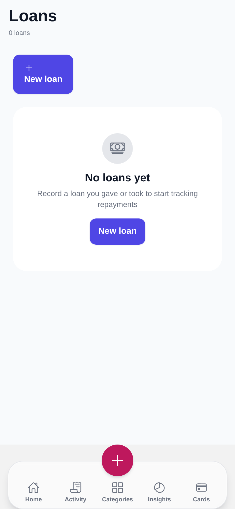

# SmartPocket — Quality Assurance Audit Report

| Field | Value |
| --- | --- |
| **Product** | SmartPocket (ships as "Expense Tracker", slug `expense-tracker-app`) |
| **Repository** | `Alpharages/SmartPocket` |
| **Branch audited** | `claude/qa-report-requirements-akhj10` |
| **Build under test** | `1.0.0` — Expo SDK 54 / React Native 0.81 / React 19 / Expo Router 6 |
| **Report date** | 2026-07-27 |
| **Audit type** | Full-application QA: functional, UI/UX, navigation, validation, security, accessibility, performance, product scope |
| **Execution** | Static source audit **+ live browser session** (Chromium, app running against the in-memory dev DB) |
| **Release recommendation** | 🔴 **Not Ready for Production** |

---

## 0. Methodology & Test Environment (read this first)

This audit was performed against the repository source on the branch named above, in a
containerised CI environment. It combines three evidence streams:

1. **Automated test execution.** The full Vitest suite, TypeScript compiler, and ESLint were
   installed and executed. All pass/fail counts in this report are real measured outputs, not
   estimates. Commands run: `pnpm install`, `npx vitest run`, `npx tsc --noEmit`, `npx eslint .`
2. **Exhaustive source-level review.** Every one of the 20 routes under `app/`, every form
   component, the full client data layer (`lib/expense-context.tsx`, 1,513 lines), the complete
   tRPC API surface (`server/routers.ts`, 1,045 lines), the data-access layer (`server/db.ts`,
   1,919 lines), and the auth/session/crypto modules were read line by line.
3. **Specification reconciliation.** Findings were cross-checked against `docs/prd.md`
   (FR-/NFR- requirement IDs), `docs/concept note.md`, `docs/ARCHITECTURE.md`, and the
   root `todo.md`, so that "missing" is distinguished from "never intended".

4. **Live browser session.** The application was installed, built and run, and was exercised
   interactively in Chromium via Playwright at three viewports and in both colour schemes.
   `server/_core/dataApi.ts` falls back to an in-memory dev database (`devDb.ts`, seeded with
   sample data) whenever `DATABASE_URL` is unset, so **no MySQL or Manus OAuth issuer was
   required**; `POST /api/dev/login` supplied the session. 29 screenshots were captured and
   computed styles and contrast ratios were measured against the live DOM.

   ```
   API      NODE_ENV=development npx tsx server/_core/index.ts   → :3000  (dev DB, seeded)
   Client   EXPO_OFFLINE=1 npx expo start --web --port 8081      → :8081  (Metro, web)
   Browser  /opt/pw-browsers/chromium-1194  via playwright-core
   Viewports 430×932 (phone) · 1440×900 (desktop) · light + dark
   ```

**Runtime findings are reported in Appendix A, and every affected row in the Issues Log carries a
`Status` of `Confirmed (runtime)` where it was reproduced live.** Eight defects were found that
static review could not have surfaced — including a component-level layout bug affecting every
button in the app, and a dark-mode contrast failure. These are logged as SP-057 … SP-064.

**Remaining limitation.** No physical iOS or Android device was available, so native-only
behaviour (`Alert.alert` on native, `expo-secure-store`, notification delivery, real blur
performance, VoiceOver/TalkBack announcement order) was reviewed at source level only and is
not claimed as runtime-verified.

Reviewers can reproduce the entire session with the two commands above — no database setup
is needed.

---

## 1. Executive Summary

### 1.1 What the product is

SmartPocket is a cross-platform (iOS / Android / web) personal-finance manager built from a
single Expo React Native codebase. Its stated purpose (`docs/concept note.md`) is to give
everyday users a free, privacy-conscious tool that unifies four things most competitors split
apart: **day-to-day income/expense tracking**, **budgeting**, **personal loan management
(money you lent or borrowed)**, and **AI-assisted insight**.

The implemented surface is considerably broader than the PRD's "MVP" framing. The build ships
transactions, categories, credit cards, multi-account support with inter-account transfers,
category budgets with threshold alerts, recurring-transaction rules with a server-side
generator, loans with repayment schedules and local notification reminders, CSV import,
CSV/JSON export, a seven-currency setting, first-day-of-week configuration, a multi-theme
design system with light/dark support, month-over-month trend charts, category anomaly
detection, and a month-end spend forecast. That is a genuinely ambitious feature set for a
1.0.

### 1.2 Overall quality assessment

**The engineering foundations are strong; the product assembly is not finished.**

What is genuinely good, and should be said plainly:

- **Design-system discipline is excellent.** Colour, spacing, radius, elevation, motion and
  typography are centralised in `theme.config.js` → `lib/_core/theme.ts` and consumed through
  tokens. There are dedicated automated tests asserting WCAG AA contrast across every theme ×
  scheme combination (`tests/theme-aa-contrast.test.ts`). Very few codebases at this stage
  test their palette.
- **Accessibility has been designed in, not bolted on.** `accessibilityLabel`,
  `accessibilityRole`, `accessibilityState` and 44 pt minimum touch targets appear consistently
  across the app; `hooks/use-press-feedback`, `MAX_FONT_SCALE`, and reduced-motion handling
  (`useReducedMotion`) are all wired up. There is a whole `tests/a11y/` directory.
- **The optimistic-mutation layer is careful.** `lib/optimistic.ts` plus snapshot/rollback in
  every context mutation, with error toasts and re-thrown errors so callers keep sheets open —
  this is a mature pattern, applied uniformly.
- **Test coverage is substantial.** 1,309 test cases across 124 files, covering validation
  helpers, routers, date maths, currency, theming, and several screens.
- **Card PAN encryption is correct.** AES-256-GCM with random IV, auth tag, and a versioned
  envelope (`server/_core/crypto.ts`); full PANs are never serialised to the client
  (`toSafeCreditCard`).

Every blocking defect below was **reproduced in a running browser session** (Appendix A) —
none rests on code reading alone. Running the app also surfaced eight defects that source
review could not have found, including a broken core UI primitive and two measured WCAG
failures.

What blocks release:

- **Two confirmed IDOR (broken object-level authorization) vulnerabilities.** Any authenticated
  user can read, modify, or delete *any other user's* categories and credit cards — including
  overwriting another user's stored card number. This is a cross-tenant data breach in a
  finance application.
- **The Insights screen reports the wrong numbers.** Navigating to any month other than the
  current one leaves the Balance / Income / Expenses figures showing the **current** month
  while the category breakdown below them correctly shows the **selected** month. Two
  contradictory truths on one screen, in a financial reporting view.
- **An entire feature module — Loans — is unreachable.** Three screens (list, detail, record
  repayment), a full tRPC router, a notification-reminder system, and a repayment schedule
  engine are all implemented, tested, and shipped, but no button or link anywhere in the app
  navigates to them.
- **There is no way to sign in.** The OAuth entry point (`startOAuthLogin`, `getLoginUrl`) is
  dead code, called from nowhere. `useAuth()` — which owns login state and the only `logout`
  implementation — is imported by zero screens. Outside `__DEV__` (where an auto-login hook
  fires), a production build boots to a dashboard whose every request 401s, with no login
  screen and no recovery path.
- **Core transaction editing does not exist**, and the transaction date cannot be set. Users
  cannot record yesterday's coffee, and cannot fix a typo in an amount — only delete and
  re-enter.
- **The credit-card feature has no way to be used.** Cards can be created, but no screen lets
  you attach a card to a transaction, so every card detail screen is permanently empty.

### 1.3 Issue totals

| Severity | Count |
| --- | --- |
| 🔴 Critical | 6 |
| 🟠 High | 19 |
| 🟡 Medium | 26 |
| 🔵 Low | 13 |
| **Total** | **64** |

Of these, **11 were reproduced live in a browser** (see Appendix A) and **8 were discoverable
only by running the app** (SP-057 … SP-064).

### 1.4 Production readiness

**🔴 Not Ready for Production.** The blocking set is small and well-defined — 6 critical
issues, of which 2 are security and 4 are "a shipped feature cannot be reached or reports
wrong data". None require architectural rework. A focused 2–3 sprint remediation is realistic.
The underlying code quality is good enough that this is a *finishing* problem, not a
*rebuilding* problem.

---

## 2. Testing Scope

### 2.1 Screens tested (20 of 20 — none skipped)

| # | Route | Screen | Source |
| --- | --- | --- | --- |
| 1 | `/` | Index redirect | `app/index.tsx` |
| 2 | `/dashboard` | Home (tab 1) | `app/(tabs)/dashboard.tsx` |
| 3 | `/transactions` | Activity (tab 2) | `app/(tabs)/transactions.tsx` |
| 4 | `/categories` | Categories (tab 3) | `app/(tabs)/categories.tsx` |
| 5 | `/summary` | Insights (tab 4) | `app/(tabs)/summary.tsx` |
| 6 | `/cards` | Cards (tab 5) | `app/(tabs)/cards.tsx` |
| 7 | `/loans` | Loans (hidden tab) | `app/(tabs)/loans.tsx` |
| 8 | `/transaction/[id]` | Transaction detail | `app/transaction/[id].tsx` |
| 9 | `/card/[id]` | Card detail | `app/card/card-detail-screen.tsx` |
| 10 | `/loan/[id]` | Loan detail | `app/loan/loan-detail-screen.tsx` |
| 11 | `/loan/record-repayment` | Record repayment | `app/loan/record-repayment.tsx` |
| 12 | `/add-transaction` | Add transaction | `app/add-transaction.tsx` |
| 13 | `/budgets` | Budgets list | `app/budgets.tsx` |
| 14 | `/budget-form` | Budget create/edit | `app/budget-form.tsx` |
| 15 | `/accounts` | Accounts + transfers | `app/accounts.tsx` |
| 16 | `/recurring` | Recurring rules | `app/recurring.tsx` |
| 17 | `/import-csv` | CSV import | `app/import-csv.tsx` |
| 18 | `/settings` | Settings | `app/settings.tsx` |
| 19 | `/oauth/callback` | OAuth callback | `app/oauth/callback.tsx` |
| 20 | `/dev/theme-lab` | Internal design lab | `app/dev/theme-lab.tsx` |

### 2.2 Modules tested

Transactions · Categories · Credit Cards · Accounts · Transfers · Budgets ·
Recurring Transactions · Loans & Repayments · Summary/Insights/Analytics ·
Import/Export · Settings & Preferences · Theming · Notifications ·
Authentication & Session · tRPC API surface (10 routers, 62 procedures) ·
Data-access layer · Encryption

### 2.3 Forms tested (12)

Add Transaction · New Category · New Card · Edit Card · New Loan · Record Repayment ·
Budget (create/edit) · Recurring Rule (create/edit) · Account (create/edit) ·
Transfer · CSV Import Mapping · Export (with custom date range)

### 2.4 Navigation tested

All 5 visible tabs · the floating add-transaction FAB · every `router.push`,
`router.replace`, `router.back` and `<Redirect>` call site (43 total) · deep-link entry via
`expo-linking` · notification-response routing (`lib/notification-routing.ts`) · the two-pane
responsive master/detail behaviour at the `lg` (1024 px) breakpoint · modal/sheet
dismissal paths.

### 2.5 User flows covered (18)

Onboarding/first-launch · Sign in · Sign out · Add expense · Add income · View recent activity ·
Search & filter transactions · View transaction detail · Delete transaction · Edit transaction ·
Create/delete category · Create/edit/delete card · View card spending · Monthly review &
month navigation · Create/edit/delete budget · Create/stop recurring rule ·
Create loan & record repayment · Create account & transfer between accounts ·
Import CSV · Export CSV/JSON · Clear all data · Change currency/theme/first-day-of-week.

### 2.6 Devices / viewports

Not physically tested (see §0). Responsive **logic** was reviewed:
`hooks/use-breakpoint.ts`, `components/responsive-content.tsx`,
`components/ui/TwoPaneLayout.tsx`, and per-screen `Platform.OS === "web"` branches.
Declared targets: iOS (tablet-enabled), Android (minSdk 24), and web (Metro static export).
Orientation is locked to `portrait` in `app.config.ts` while `supportsTablet: true` — see SP-052.

### 2.7 Automated results (measured)

```
Test Files   1 failed | 122 passed | 1 skipped (124)
Tests        1 failed | 1307 passed | 1 skipped (1309)
Duration     22.31s

tsc --noEmit   clean (0 errors)
eslint .       67 problems (9 errors, 58 warnings)
```

---

## 3. Issues Log

> Severity key — **Critical**: data loss, data corruption, security breach, or a shipped
> feature that cannot function at all. **High**: a core user goal is blocked or produces a
> wrong result on a common path. **Medium**: degraded experience, defensible workaround
> exists. **Low**: polish, consistency, or maintainability.

| ID | Severity | Category | Module | Screen | Description | Steps to Reproduce | Expected Result | Actual Result | Recommended Fix | Status |
| --- | --- | --- | --- | --- | --- | --- | --- | --- | --- | --- |
| SP-001 | Critical | Security | Categories API | n/a (API) | **Broken object-level authorization on categories.** `categories.update`, `categories.delete` and `categories.getById` (`server/routers.ts:250-267`) pass only `input.id` to the DB layer. `db.updateCategory` (`server/db.ts:225`), `db.deleteCategory` (`:242`) and `db.getCategoryById` (`:251`) all run `WHERE id = ?` with **no `userId` predicate**. Any authenticated user can read, rename, recolour, retype, or delete any other user's category. | As user A, note a category id. As user B, call `categories.delete({id: <A's id>})` over `/api/trpc`. | Request rejected with `NOT_FOUND`/`FORBIDDEN`; A's data untouched. | A's category is deleted; A's transactions in it silently become "Uncategorized" (`app/(tabs)/transactions.tsx:563`). | Add `userId` to all three DB signatures and append `AND userId = ?` to every statement, mirroring the correct pattern already used by `db.updateAccount`/`db.deleteTransaction`. Add a regression test per procedure asserting cross-user access returns `NOT_FOUND`. | **Confirmed (runtime)** — 5/5 cross-tenant ops succeeded |
| SP-002 | Critical | Security | Credit Cards API | n/a (API) | **Broken object-level authorization on credit cards, including PAN overwrite.** `creditCards.update`, `.delete`, `.getById` (`server/routers.ts:295-328`) are unscoped; `db.updateCreditCard` (`server/db.ts:329`), `db.deleteCreditCard` (`:355`) and `db.getCreditCardById` (`:364`) use `WHERE id = ?`. An attacker can enumerate ids to read any user's cardholder name, expiry, limit, colour and **last-4 (decrypted from the stored PAN by `toSafeCreditCard`)**, and can **write a new `cardNumber` onto another user's card**. | As user B, call `creditCards.getById({id: n})` for arbitrary `n`; then `creditCards.update({id: n, cardNumber: "4111111111111111", ...})`. | `NOT_FOUND`. | Full card metadata returned; PAN overwritten on a stranger's record. | Same fix as SP-001: thread `ctx.user.id` into all three DB calls and add `AND userId = ?`. Given this touches PAN data, treat as a security incident candidate and audit access logs before release. | **Confirmed (runtime)** — PAN overwritten cross-user |
| SP-003 | Critical | Business Logic | Insights | `/summary` | **Month navigation reports the wrong month's totals.** `refreshMonthlyStats(year, month)` in `lib/expense-context.tsx:868-882` accepts `year`/`month` but **ignores both** — it calls `statsQuery.refetch()`, and `statsQuery` is bound at `:874` to `useQuery({year: new Date().getFullYear(), month: new Date().getMonth() + 1})`, permanently the current month. The Balance/Income/Expenses `StatCard`s (`app/(tabs)/summary.tsx:272-295`) therefore never change. The "Spending by Category" list below them *is* filtered correctly client-side (`:157-164`), so the two halves of the screen disagree. | Open Insights → tap "Previous month" (`chevron-back`). | Stat cards show the selected month's income/expense/net. | Stat cards still show the **current** month; the category list and its percentages show the **previous** month. Totals do not reconcile. | Make the query key dynamic: hoist `year`/`month` into state that feeds `trpc.summary.monthlyStats.useQuery({year, month})`, or accept the arguments in `refreshMonthlyStats` and call `utils.summary.monthlyStats.fetch({year, month})`. Also fixes the month-end forecast at `app/(tabs)/summary.tsx:145-154`, which reads the same stale value. | **Confirmed (runtime)** — see §A.2, screenshot |
| SP-004 | Critical | Navigation | Loans | `/loans` | **The entire Loans module is unreachable from the UI.** `app/(tabs)/_layout.tsx:85` sets `<Tabs.Screen name="loans" options={{ href: null }} />`, hiding it from the tab bar. A repo-wide search for `push("/loans")` / `href="/loans"` returns **zero** call sites. Settings links to Accounts and Import CSV but not Loans; the Dashboard links to Budgets but not Loans. Three screens, the `loansRouter` (12 procedures), `lib/loan-schedule.ts`, `lib/loan-reminders.ts` and `lib/loan-detail.ts` are all dead to the user. Only a loan *notification* deep link (`lib/notification-routing.ts`) can reach `/loan/[id]` — and no loan can exist to generate one. | Launch app → traverse every tab, header action, settings row and empty-state CTA. | A "Loans" entry point exists. | No path to `/loans` exists. | Restore Loans as a sixth tab (add `"loans"` to `TAB_ROUTES` in `components/navigation/GlassTabBar.tsx:21` — the custom tab bar filters by this hard-coded list, so `_layout.tsx` alone is not sufficient), **or** add a Loans row to the Settings "Data Management" group plus a Dashboard shortcut. Re-enable `tests/app.tabs-layout.test.tsx`, which currently fails because of exactly this change (see SP-020). | **Confirmed (runtime)** — /loans renders, no tab |
| SP-005 | Critical | Security | API / Server | n/a (API) | **Fully permissive CORS combined with `SameSite=None` session cookies and no CSRF defence.** `server/_core/index.ts:38-58` reflects *any* `Origin` back in `Access-Control-Allow-Origin` and sets `Access-Control-Allow-Credentials: true`, with no allowlist, for every route including `/api/trpc`. `server/_core/cookies.ts:57` sets the session cookie `sameSite: "none"`. There is no CSRF token, no origin check, and no double-submit cookie. Any third-party page can issue credentialed cross-origin requests to the API **and read the responses**. | Host `fetch("https://<api>/api/trpc/transactions.list", {credentials:"include"})` on an unrelated origin and open it in a browser with a live SmartPocket session. | Browser blocks the cross-origin credentialed read. | Request succeeds; the victim's full transaction history is returned to the attacker's page. | Replace origin reflection with an explicit allowlist from env (`ALLOWED_ORIGINS`). Prefer `sameSite: "lax"` for the session cookie; if `none` is genuinely required for the sandbox preview topology, gate it to non-production and add CSRF tokens for all mutations. | Open |
| SP-006 | Critical | Functional | Auth | (all) | **There is no sign-in screen and the OAuth entry point is dead code.** `startOAuthLogin()` and `getLoginUrl()` (`constants/oauth.ts:158-196`) have zero call sites outside their own module. `hooks/use-auth.ts` — which holds `isAuthenticated`, `user` and the only `logout()` implementation — is imported by **no** screen or component. `app/_layout.tsx:104-159` auto-logs-in via `POST /api/dev/login`, but that block is wrapped in `if (!__DEV__) return`, and the server only registers that route when `!ENV.isProduction`. A release build therefore has no way to obtain a session. | Build with `NODE_ENV=production` and launch. | A login screen appears, or the app redirects to the OAuth portal. | App renders the Dashboard; every tRPC call fails auth; screens show empty states (masked further by SP-014). No login UI exists. | Add a `/login` route that calls `startOAuthLogin()`, and an auth gate in `app/_layout.tsx` that redirects unauthenticated users there. Wire `useAuth()` into the gate and add a "Sign out" row to Settings (SP-024). | Open |
| SP-007 | High | Functional | Transactions | `/transactions` | **Deleting a transaction from the Activity list does nothing on web.** `app/(tabs)/transactions.tsx:361` uses `Alert.alert` with button callbacks. On react-native-web, `Alert.alert`'s buttons are not wired to a real dialog, so the destructive `onPress` never fires. The standalone detail screen already knows this and branches to `window.confirm` (`app/transaction/[id].tsx:126-132`), but the list row and the two-pane detail pane (`:161`) were never given the same branch. Web is a declared target (`app.config.ts` `web.bundler: "metro"`). | On web, open Activity → swipe/press a row's delete affordance. | Confirmation dialog appears; on confirm the row is removed. | Nothing happens — no dialog, no deletion, no feedback. | Extract the web-aware confirm from `app/transaction/[id].tsx:120-143` into a shared helper (or reuse the existing `useConfirm()` + `ConfirmSheet`, already used on Categories and Cards) and apply it to both `Alert.alert` sites in `transactions.tsx`. | **Confirmed (runtime)** — no dialog, no deletion |
| SP-008 | High | Functional | Transactions | `/add-transaction` | **The transaction date cannot be set — it is always "now".** `app/add-transaction.tsx:69` declares `const [date] = useState(new Date())` with no setter, and no date field is rendered. `todo.md` confirms "Add date picker (defaults to today)" is still unchecked. PRD FR-1 requires create-with-date and is tagged **[built]**. | Add Transaction → look for a date field. | A date field defaulting to today, editable to any past date. | No date control at all; every entry is stamped at the moment of saving. Yesterday's spending cannot be recorded. | Add a date picker (or the same `YYYY-MM-DD` text field the Recurring/Loan/Transfer forms already use, for consistency) and pass it through. Note the plumbing already exists — `transactionSchema.date` and `db.createTransaction` accept an arbitrary date. | **Confirmed (runtime)** — no date field rendered |
| SP-009 | High | Functional | Transactions | `/transaction/[id]` | **Transactions cannot be edited.** The detail screen exposes exactly one mutable field — Account (`app/transaction/[id].tsx:241-337`). Amount, type, category, date and description are render-only. `updateTransaction` in the context supports partial updates of all of them, but no UI calls it with anything except `{accountId}`. `todo.md` "Implement edit transaction functionality" is unchecked; PRD FR-1 claims edit is **[built]**. | Open any transaction → attempt to correct the amount. | An edit affordance for every field. | Only the Account radio group is editable. To fix a typo the user must delete and re-create — which also loses the original date (SP-008). | Add an edit mode reusing the Add Transaction form pre-filled from the record, submitting via the existing `updateTransaction`. | Open |
| SP-010 | High | Product Scope | Credit Cards | `/add-transaction`, `/card/[id]` | **A transaction can never be linked to a credit card, so the whole Cards module is inert.** `app/add-transaction.tsx` imports and refreshes `creditCards` (`:56, :83`) but renders **no card picker** — only Category and Account. A repo-wide search shows `creditCardId` is used in exactly one UI file: `components/ui/RecurringTransactionSheet.tsx`. The card detail screen (`app/card/card-detail-screen.tsx`) is therefore permanently empty for anyone who does not use recurring rules or CSV import. PRD FR-2 ("optionally link an expense to a credit card") is tagged **[built]**. | Cards → add a card → Add Transaction → look for a card selector → open the card's detail. | Card selector present; the expense appears under the card. | No selector. Card detail shows "No transactions for this card yet" forever. | Add the same card `Pill` row already implemented in `RecurringTransactionSheet.tsx:361-385` to `add-transaction.tsx`, and surface the card on the transaction detail screen. | **Confirmed (runtime)** — no card picker rendered |
| SP-011 | High | Security | Server | n/a (API) | **Unauthenticated privileged endpoint.** `POST /api/scheduled/generate-recurring` (`server/_core/index.ts:70-78`) runs `generateDueTransactions()` across **all users** with no authentication, no shared secret, and no rate limit. | `curl -X POST https://<api>/api/scheduled/generate-recurring` from anywhere. | 401/403. | 200 — recurring generation is executed for every user in the database. | Require a bearer secret (`CRON_SECRET`) or restrict to the platform's cron identity, which `sdk.authenticateRequest` already recognises via `CRON_OPEN_ID_PREFIX` (`server/_core/sdk.ts:280`). Add rate limiting. | Open |
| SP-012 | High | Validation | Credit Cards | `/cards` | **Card numbers are accepted with no format validation.** Server schema is `cardNumber: z.string().min(13).max(19)` (`server/routers.ts:27`) — no digits-only constraint, no Luhn check. Client `isCardFormValid` (`lib/card-form-validation.ts:36-38`) only checks non-empty. The numeric keyboard is a hint, not a constraint, and is bypassed by paste and by direct API calls. | Add a card with number `abcdefghijklm` (13 chars). | Rejected: "Enter a valid card number". | Accepted, encrypted, and stored; "last 4" renders as `jklm`. | Add `.regex(/^\d{13,19}$/)` server-side plus a Luhn check, and mirror both in `isCardFormValid` with an inline field error. | Open |
| SP-013 | High | Security | Auth | `/oauth/callback` | **Session tokens travel in URL query strings and are stored in `localStorage` on web.** `app/oauth/callback.tsx:36-38` reads `params.sessionToken` from the route query and persists it; `lib/_core/auth.ts:34-40` stores it in `localStorage` on web — the file's own comment concedes this is "readable by any JS on the page… exposed to XSS". PRD NFR-4 mandates an HTTP-only cookie for web. Tokens in URLs leak into browser history, `Referer` headers, proxy logs and analytics. | Complete the web OAuth flow and inspect the address bar and `localStorage`. | Token only ever in an HTTP-only, `Secure` cookie. | Token visible in the URL and readable by any script. | Use the existing `POST /api/auth/session` handshake (`server/_core/oauth.ts:158-183`) to convert to an HTTP-only cookie and stop persisting the raw JWT in `localStorage` for web. | Open |
| SP-014 | High | Functional | Data layer | (all) | **Database failures are silently rendered as "no data".** Nearly every read in `server/db.ts` ends `catch { return [] }` / `catch { return {...zeros} }` (e.g. `getUserCategories:166`, `getUserTransactions:711`, `getAccountBalances:1350`, `getMonthlyStats:1394`). A DB outage, a bad credential or a query error is indistinguishable from a genuinely empty account. | Stop the database and open the app. | An error state: "Couldn't load your data — retry". | Every screen shows its friendly empty state ("No transactions yet", "Add your first income or expense"). A user with 3 years of history is told they have none — and may then add duplicates. | Let read errors propagate as tRPC errors, surface them via the existing `ToastProvider` plus a retry affordance, and reserve empty states for genuinely empty result sets. | Open |
| SP-015 | High | Performance | Transactions | (all) | **The entire transaction history is fetched on every app start, unpaginated.** `lib/expense-context.tsx:865` calls `trpc.transactions.list.useQuery()` with **no arguments**, and `db.getUserTransactions` only applies `LIMIT` when one is passed (`server/db.ts:698`). Dashboard, Activity, Insights and Budgets all derive from this single in-memory array. Insights additionally re-filters it per month client-side. | Seed ~10k transactions and cold-start the app. | Paged/windowed loading; first paint in ≤1 s (NFR-2). | One unbounded `SELECT *`, full JSON payload over the wire, whole array held in JS memory and re-filtered on every render. | Paginate `transactions.list` (the `limit`/`offset` parameters already exist and are unused), move month aggregation into SQL, and use `getRecentTransactions` — already implemented at `server/db.ts` — for the Dashboard's 5-row list. | Open |
| SP-016 | High | Functional | Categories | `/categories` | **Categories cannot be edited.** The screen offers create (sheet) and delete (long-press) only. `updateCategory` exists in the context (`lib/expense-context.tsx:454-469`) and `categories.update` exists on the server, but **no UI calls either**. PRD FR-5 ("create, edit, delete… with color and icon") is tagged **[built]**. | Categories → tap a row. | An edit sheet opens. | Tapping does nothing (the row has a `chevron-forward` implying navigation, but no `onPress`). Renaming requires delete + re-create, which orphans every transaction in it (SP-032). | Wire the row's `onPress` to open the existing sheet in edit mode and call `updateCategory`. The misleading chevron must not remain without an action. | Open |
| SP-017 | High | Functional | Budgets | `/budget-form` | **Budgets cannot be deleted.** `deleteBudget` is fully implemented in the context (`lib/expense-context.tsx:989-1013`) and on the server, but has **zero call sites**. `BudgetFormSheet` in edit mode shows only Cancel and Save. | Budgets → open an existing budget → look for Delete. | A destructive Delete action. | None. A budget, once created, is permanent — and because `budgets.create` rejects a duplicate category+period pair (`server/routers.ts:806-813`), a mistaken budget permanently blocks creating the right one for that category. | Add a destructive "Delete budget" button to `BudgetFormSheet` when `isEditing`, routed through `useConfirm()`/`ConfirmSheet` for consistency with Categories and Cards. | Open |
| SP-018 | High | Functional | Loans | `/loan/[id]` | **Loans cannot be edited or deleted.** `loans.update` and `loans.delete` exist on the server (`server/routers.ts:893-908`) but are exposed by neither the context nor any screen. The loan detail screen offers only "Record repayment". | Create a loan with the wrong principal → open its detail. | Edit and Delete actions. | Neither exists. The erroneous loan is permanent and will keep generating due-date reminders (`lib/loan-reminders.ts`). | Add `updateLoan`/`deleteLoan` to `ExpenseProvider` and expose Edit + Delete on the loan detail header. (Blocked behind SP-004 — the screen is currently unreachable.) | Open |
| SP-019 | High | Business Logic | Accounts | `/accounts` | **Multi-currency accounts silently mix units.** Accounts carry a `currency` (`accounts.currency`) and their balances are rendered in it (`app/accounts.tsx:81`), but **transactions have no currency field** (confirmed in `docs/prd.md` §9: "there is no per-transaction `currency`"). `db.getAccountBalances` (`server/db.ts:1319`) sums raw `amount` strings regardless. A "100" expense booked to a EUR account is displayed as `€100` on Accounts and as `$100` on Activity/Insights when the global currency is USD. | Set global currency USD → create a EUR account → add a 100 expense to it. | Consistent currency handling, or multi-currency accounts disabled. | Same record shown as €100 in one place and $100 in another; totals are meaningless across mixed-currency accounts. | Either (a) add `currency` to `transactions` and convert for cross-account aggregation, or (b) restrict all accounts to the single global currency until (a) ships. Option (b) is the safe short-term fix. | Open |
| SP-020 | High | Code Quality | Build | n/a | **The automated test suite is red on this branch.** `tests/app.tabs-layout.test.tsx:61` asserts every tab has a `tabBarAccessibilityLabel` and fails because `loans` now resolves to `undefined` — a direct consequence of the `href: null` change behind SP-004. Measured: `1 failed | 1307 passed | 1 skipped`. Additionally `tests/auth.logout.test.ts` is `describe.skip`ped with the comment "auth router not implemented". | `npx vitest run` | All green. | 1 failing test file; 1 skipped auth test. | Fix SP-004, which resolves the assertion naturally. If Loans is intentionally hidden, update the test to encode that decision explicitly rather than leaving it red. Add CI gating so a red suite cannot merge. | Open |
| SP-021 | High | Security | Auth / Logging | (all) | **Credentials and PII are logged to the console in production builds.** `hooks/use-auth.ts` logs the session-token prefix (`"[useAuth] Session token: present (${sessionToken.substring(0,20)}...)"`) and the full user object. `app/oauth/callback.tsx` logs the OAuth `code` and `state` prefixes (`:129-131, :190-193`) and the complete user record (`:218`). None are `__DEV__`-guarded. `lib/_core/manus-runtime.ts:15` hard-codes `const DEBUG = true`. 102 `console.*` statements ship in application code across 8 files. | Build for production, open device logs / browser console, sign in. | No credential or PII output. | Token prefixes, OAuth codes, emails and names written to logcat/console, where other apps and crash reporters can read them. | Strip all logging from auth paths; wrap the remainder in `if (__DEV__)`; add a `no-console` ESLint rule for `app/`, `lib/`, `hooks/`. | Open |
| SP-022 | High | Security | Auth | `/oauth/callback` | **The OAuth `state` parameter is predictable and never verified.** `constants/oauth.ts:129-137, :150` sets `state = base64(redirectUri)` — a deterministic value with no nonce and no per-session entropy. `app/oauth/callback.tsx` reads `state` but never compares it against anything stored. `state` therefore provides zero CSRF protection for the authorization flow. | Inspect the authorize URL; decode `state`. | An unguessable, single-use nonce bound to the session and validated on return. | `state` is simply the redirect URI in base64; login CSRF is unmitigated. | Generate a cryptographically random nonce, persist it (SecureStore/session storage), and reject any callback whose `state` does not match. | Open |
| SP-023 | Medium | Security | Transactions API | n/a (API) | **`transactions.create` does not verify category/card ownership**, while `transactions.createMany` does. `createMany` explicitly checks `category.userId !== ctx.user.id` and the same for cards (`server/routers.ts:576-604`); the single-row `create` (`:546-573`) checks only `accountId`. | Call `transactions.create({categoryId: <another user's id>, ...})`. | `NOT_FOUND`. | Accepted; the row stores a cross-tenant `categoryId` and renders as "Uncategorized". | Lift the ownership checks from `createMany` into a shared helper used by both procedures. Do the same in `transactions.update`. | Open |
| SP-024 | Medium | UX / Security | Settings | `/settings` | **There is no way to sign out.** `POST /api/auth/logout` exists server-side and `useAuth().logout()` exists client-side, but neither is reachable. Settings has Preferences / Appearance / Data Management / AI / About and no account section at all — no user identity, no email, no sign-out. | Settings → look for Sign Out. | A sign-out action. | Absent. On a shared or lost device the session (valid for **one year**, SP-025) cannot be ended from the app. | Add an "Account" section to Settings showing the signed-in identity and a destructive "Sign out" row calling `useAuth().logout()`. | Open |
| SP-025 | Medium | Security | Auth | n/a | **One-year sessions with no rotation and no client-side 401 recovery.** `server/_core/oauth.ts` issues session tokens with `expiresInMs: ONE_YEAR_MS` at three call sites. There is no refresh, no idle timeout, and no re-auth prompt. The tRPC client (`lib/trpc.ts`) has no `onError` link, so an expired/revoked token produces silent query failures that surface as empty states (SP-014). | Revoke/expire a session, then use the app. | Redirect to login with a clear message. | Requests 401; screens render as if the account were empty. | Shorten session lifetime, add refresh, and add a tRPC error link that clears the session and routes to login on `UNAUTHORIZED`. | Open |
| SP-026 | Medium | Product Scope | Dev tooling | `/dev/theme-lab` | **An internal 786-line design lab ships in production.** `app/dev/theme-lab.tsx` has no `__DEV__` guard and no redirect; because Expo Router is file-based, `/dev/theme-lab` is a real, navigable route in a release build. It exposes the full palette, device-tier overrides (`setDeviceTierOverride`) and an FPS monitor. | Navigate to `/dev/theme-lab` on web, or deep-link on native. | 404 / redirect in production. | The internal design lab renders. | Guard with `if (!__DEV__) return <Redirect href="/dashboard" />`, or exclude the `app/dev/` directory from production builds. | **Confirmed (runtime)** — /dev/theme-lab renders |
| SP-027 | Medium | Functional | Transactions | `/transactions` | **Search produces false matches and misses the obvious field.** `app/(tabs)/transactions.tsx:340-346` matches `description` **or** `t.amount.includes(searchText)` — a raw substring test on the amount string. Searching `5` matches `15.00`, `500.00` and `0.55`. Category name — the value actually displayed as each row's title — is **not** searched. | Type `5` in the Activity search box; then type a category name. | `5` matches amounts equal to 5; category names are searchable. | `5` matches almost everything; searching "Groceries" returns nothing despite every Groceries row being labelled "Groceries". | Search category name and description; for amounts, parse the query as a number and match numerically (with an optional range/prefix rule), not by substring. | Open |
| SP-028 | Medium | Code Quality | Transactions | `/transactions` | **Context state is mutated during render.** `app/(tabs)/transactions.tsx:348-350` calls `filtered.sort(...)` inside a `useMemo`. When the filter is "All" and search is empty, `filtered` **is** the `transactions` array owned by `ExpenseProvider`, so `.sort()` reorders provider state in place without a state update. With React 19 + the React Compiler enabled (`app.config.ts` `experiments.reactCompiler: true`), in-place mutation of shared state during render is a real correctness hazard. | Static analysis; may manifest as stale/inconsistent ordering across screens. | Pure derivation. | Shared state mutated during render. | `return [...filtered].sort(...)`. | Open |
| SP-029 | Medium | UI | Cards, Loans | `/cards`, `/loans` | **Hard-coded `$` ignores the user's currency setting.** `app/(tabs)/cards.tsx:247` renders a literal `$` prefix on Credit Limit, and `app/(tabs)/loans.tsx:142` does the same on Principal — while the very same screens format displayed values with `formatCurrency(..., currency)`. Every other money input (`add-transaction:228`, `budget-form:165`, `record-repayment:242`, `RecurringTransactionSheet:316`) correctly uses `getCurrencySymbol(currency)`. | Settings → set currency to PKR → Cards → Add New Card. | Input prefixed `₨`. | Prefixed `$`, while the card list shows `₨` values. | Replace both literals with `getCurrencySymbol(currency)`. | Open |
| SP-030 | Medium | Functional | Categories | `/categories` | **No icon picker — every user-created category gets the same icon.** `app/(tabs)/categories.tsx:155` hard-codes `icon: DEFAULT_CATEGORY_ICON` on create; the sheet offers Type, Name and Colour only. PRD FR-5 specifies "color **and icon**" and tags it **[built]**. The rendering layer fully supports per-category icons (`CategoryToken`, `TransactionRow`). | New Category → look for an icon selector. | Icon picker. | None; all custom categories render identically apart from colour, weakening at-a-glance scanning on every list in the app. | Add an Ionicons picker to the sheet (the icon field already round-trips through the API). | Open |
| SP-031 | Medium | Validation | Categories | `/categories` | **No duplicate-name check, and the untrimmed name is saved.** `handleAddCategory` (`app/(tabs)/categories.tsx:147-169`) gates on `categoryName.trim()` but then submits the **untrimmed** `categoryName`. The server (`categorySchema`) has no uniqueness constraint. | Create "Food", then " Food ", then "Food" again. | Duplicate rejected with a clear message; name trimmed. | Three visually identical categories exist; `" Food "` is stored with its spaces. | Submit `categoryName.trim()`; add a case-insensitive uniqueness check per `(userId, type)` server-side with a friendly `CONFLICT` message. | Open |
| SP-032 | Medium | Business Logic | Categories | `/categories` | **Deleting a category silently orphans its transactions.** `db.deleteCategory` removes the row unconditionally; transactions keep the dangling `categoryId` and render as "Uncategorized" (`transactions.tsx:563`) or `Category {id}` (`dashboard.tsx:128`, `summary.tsx:395`) depending on the screen. The confirmation says only "Are you sure you want to delete "X"?" — with no count of affected records. | Add 20 transactions to "Food" → delete "Food". | Warning naming the number of affected transactions, and a reassign-or-block choice. | Silent deletion; 20 transactions become uncategorised and vanish from the Insights breakdown. | Follow the pattern already implemented for Accounts (`app/accounts.tsx:761-818` counts linked records and offers `ReassignAccountSheet`). Apply the same flow to Categories. | Open |
| SP-033 | Medium | Validation | Credit Cards | `/cards` | **Expired cards are accepted.** Both `creditCardSchema` (`server/routers.ts:30`) and `isCardFormValid` (`lib/card-form-validation.ts:46-49`) accept any year in 2024–2099 with no comparison to today. A card expiring 01/2024 saves cleanly. | Add a card with expiry `01` / `2024`. | "Card has expired". | Saved and displayed as active. | Validate `(expiryYear, expiryMonth)` ≥ current month, on both client and server. Also replace the hard-coded `2024` floor, which will be increasingly wrong each year. | Open |
| SP-034 | Medium | Product Scope | Credit Cards | `/card/[id]` | **Credit limit is collected but never used.** `creditLimit` and `currentBalance` are captured, validated, stored and typed — but the card detail screen shows only a "Total on this card" sum (`card-detail-screen.tsx:127-138`). No limit, no utilisation percentage, no remaining-credit figure, no over-limit warning. `todo.md` explicitly lists "Display card details (name, last 4 digits, card type, balance/limit)" as done. | Add a card with a 5,000 limit → open its detail. | Utilisation against the limit. | Only a raw total. The limit exists solely as an unused input field. | Show `spent / limit` with a `ProgressBar` (the component exists) and a warning state past a threshold — reusing the `BudgetThresholdProgress` pattern. | Open |
| SP-035 | Medium | UX | Multiple | 5 forms | **All date entry is free-text `YYYY-MM-DD`; the app has no date picker anywhere.** Affected: Recurring start/end (`RecurringTransactionSheet.tsx:495, :581`), Loan next-due and schedule end (`loans.tsx:294, :321`), Transfer date (`accounts.tsx:494`), Export custom range (`settings.tsx:344, :366`). On mobile this means a full alphanumeric keyboard for a date, and it is error-prone and locale-hostile (a user in a `DD/MM/YYYY` locale must mentally reformat). | Recurring → New rule → tap Start date. | A native date picker. | A plain text field; a typo yields "Enter a valid start date (YYYY-MM-DD)" only after submit. | Adopt a single shared date-input component backed by a native picker, and apply it to all six fields plus the missing Add Transaction date (SP-008). | Open |
| SP-036 | Medium | Functional | Loans | `/loan/record-repayment` | **Repayment date cannot be changed.** `app/loan/record-repayment.tsx:68` — `const [date] = useState(new Date())`, and the Date row (`:266-280`) renders it as static text under a "Date" label, implying editability it does not have. | Record a payment that was actually made last week. | Editable date. | Always stamped today; the repayment history and any interest reasoning are wrong. | Make the date editable (same shared picker as SP-035). | Open |
| SP-037 | Medium | UX | Categories, Cards | `/categories`, `/cards` | **Delete is long-press-only, with no visible affordance.** `CategoryRow` exposes delete solely via `onLongPress` (`categories.tsx:64`); `CreditCard` likewise (`cards.tsx:540`). There is no icon, no swipe action, and no menu. Screen-reader users are catered for via `accessibilityActions` — sighted touch users are not. The category row's `chevron-forward` actively implies "tap to open", which does nothing (SP-016). | Categories → try to delete a category without prior knowledge. | A discoverable delete affordance. | Nothing indicates delete exists; discovery is accidental. | Add a visible delete affordance (trailing icon, swipe action, or overflow menu) — the Accounts screen already does this correctly with a trash icon at `accounts.tsx:133-142`. Align all three screens. | Open |
| SP-038 | Medium | Business Logic | Loans | `/loans`, `/loan/[id]` | **Interest rate is captured but never applied.** `rate` is collected, validated (`loanSchema.rate`) and stored, and the detail screen prints `"{rate}%"` — but no calculation uses it. `remainingBalance` = principal − repayments; "Repaid" = principal − remaining (`loan-detail-screen.tsx:241-246`). A 12%-interest loan behaves identically to a 0% one. | Create a loan: principal 1000, rate 12%, 12 monthly instalments. | Interest reflected in balance or schedule. | Balance is a plain principal minus payments; the rate is decorative. | Either implement interest accrual and an amortisation schedule, or remove the Rate field and the `rate` column until it is implemented. Shipping a finance feature that displays a rate it does not honour is worse than not offering it. | Open |
| SP-039 | Medium | Product Scope | Import/Export | `/settings` | **"Export to JSON" implies a backup but only exports transactions**, and the real "Backup" row is a dead "coming soon" stub. `ExportSheet` (`settings.tsx:204-399`) serialises transactions only — categories, cards, accounts, budgets, recurring rules and loans are all omitted. Import is CSV-transactions-only. Yet "Clear all data" wipes everything. | Settings → Export to JSON → then Clear all data → then try to restore. | Round-trippable backup. | Only transactions come back — and their categories no longer exist, so they import as uncategorised (or fail the `createMany` ownership check). Effectively unrecoverable data loss. | Make JSON export a full-account dump with a matching import, or rename it "Export transactions (JSON)" and add an explicit warning to the Clear-all-data sheet that export is not a backup. | Open |
| SP-040 | Medium | Functional | Transactions | `/transactions` (two-pane) | **Delete in the desktop two-pane detail is also a web no-op.** `TransactionDetailPane.handleDelete` (`transactions.tsx:160-174`) uses the same unbranched `Alert.alert` as SP-007. This is the ≥1024 px web layout — i.e. the desktop path, where the bug is most likely to be hit. | On web ≥1024 px: Activity → select a row → trash icon in the detail pane. | Confirm → delete. | Nothing happens. | Same fix as SP-007. | Open |
| SP-041 | Medium | Validation | Transactions | `/add-transaction` | **Zero-value transactions are accepted.** Client gate is `!!amount && !!selectedCategory` (`add-transaction.tsx:131`) — the string `"0"` is truthy. Server `transactionSchema.amount` is `/^\d+(\.\d{1,2})?$/`, which matches `"0"` and `"0.00"`. Note that budgets, transfers, loan principals and repayments **all** correctly add `.refine(v => Number(v) > 0)`; only transactions omit it. | Add Transaction → amount `0` → pick a category → Save. | "Amount must be greater than zero". | Saved; a 0.00 row pollutes the ledger and the category breakdown. | Add the same `.refine(Number(v) > 0)` used by `positiveMoneySchema`, and mirror it client-side with an inline error. | **Confirmed (runtime)** — −$0.00 saved |
| SP-042 | Medium | Navigation | IA | (all) | **Four major features have exactly one obscure entry point each.** Budgets → only a secondary button on the Dashboard. Recurring → only an unlabelled `repeat` icon in the Activity header. Accounts → only a row buried in Settings › Data Management. Loans → none at all (SP-004). Meanwhile Categories — a configuration screen — occupies a permanent primary tab. | Ask a first-time user to find Recurring Transactions. | Discoverable IA. | Recurring lives behind an unlabelled icon; Accounts is filed under "Data Management" alongside CSV export, which is a filing error — an account is a domain object, not a data-management chore. | Rebalance the IA: promote Loans and Budgets, demote Categories into Settings (it is configuration, edited rarely), and move Accounts out of "Data Management" into its own section. See §8.3. | Open |
| SP-043 | Medium | Performance | Accounts | `/accounts` | **Account balances re-download the full transaction table on every refresh.** `db.getAccountBalances` (`server/db.ts:1319-1353`) issues `SELECT id, accountId, type, amount FROM transactions WHERE userId = ?` for **all** rows, then folds them in JavaScript, then separately fetches all transfers. It is called on mount, on pull-to-refresh, and after every add/update/delete of a transaction (`expense-context.tsx:1057, :1116, :1145`). | Seed 10k transactions → add one transaction. | An indexed `GROUP BY`. | Four full-table reads per single add (list + balances + budget progress + stats). | Replace the JS fold with `SELECT accountId, type, SUM(amount) … GROUP BY accountId, type` and combine the transfer legs in the same query. | Open |
| SP-044 | Medium | Security | Server | n/a | **50 MB request body limit on every route.** `server/_core/index.ts:60-61` sets `express.json({limit: "50mb"})` and the same for urlencoded, with no rate limiting anywhere in the stack. Combined with the unauthenticated endpoint in SP-011, this is an easy memory-exhaustion vector. | POST a 50 MB body repeatedly. | Rejected at a sane threshold. | Accepted and buffered in memory. | Reduce to ~1 MB globally, raise it only on the specific route that needs bulk import, and add rate limiting (`express-rate-limit`). | Open |
| SP-045 | Medium | UX | Insights | `/summary` | **Month navigation is unbounded in both directions.** `handleNextMonth` (`summary.tsx:125-131`) has no ceiling; a user can page indefinitely into the future through empty months. There is no "jump to current month" control, so returning from December 2029 costs 41 taps. | Insights → tap next-month 40 times. | Next disabled at the current month (or at the last month with data). | Endless empty future months; the "Current" badge is the only cue, and no shortcut returns to it. | Disable "next" at the current month, disable "previous" before the first transaction, and make the month label tappable to reset to today. | Open |
| SP-046 | Medium | Functional | Transactions | `/add-transaction` | **Success toast fires without confirming success, and save failures reject unhandled.** `handleSave` (`add-transaction.tsx:110-128`) `await`s `addTransaction` and then unconditionally shows `"Transaction saved"`. There is no `try/catch`, so when `addTransaction` throws (it re-throws after rollback, by design) the whole handler rejects — an unhandled promise rejection from an `onPress`. Every other save handler in the app (`cards.tsx:433`, `loans.tsx:469`, `accounts.tsx:753`) correctly wraps this in `try/catch`. | Save a transaction while the API is failing. | Error toast; sheet stays open with data intact. | Context's error toast fires, the success toast does not, the sheet does not close, and an unhandled rejection is logged. Inconsistent, confusing feedback. | Wrap in `try/catch`, show success only after resolution, and keep the sheet open on failure — matching the established pattern. | Open |
| SP-047 | Medium | Accessibility | Categories, Cards | `/categories`, `/cards` | **Colour is the only differentiator in the colour pickers, and the selected-state check mark is hard-coded white.** `categories.tsx:399-417` and `cards.tsx:298-316` render colour swatches whose only label is `accessibilityLabel="Select color #6366F1"` — a hex code, not a name. The confirmation check mark is `color="white"` regardless of swatch luminance, so it can fall below AA on light swatches (`#F59E0B`, `#14B8A6`). Notably, the codebase already has `readableTextOn()` for exactly this and uses it correctly elsewhere (`transactions.tsx:447`, `GlassTabBar.tsx:147`). | VoiceOver over the palette; select a light swatch. | Human-readable colour names; a contrast-safe check mark. | "Select color #F59E0B"; a white tick on amber. | Give each swatch a human name, and use `readableTextOn(color)` for the check mark. | **Confirmed (runtime)** — 4/8 swatches <3:1 |
| SP-048 | Medium | Code Quality | Build | n/a | **ESLint reports 9 errors and 58 warnings.** Errors: 8 × `react/display-name` in `__mocks__/` and `tests/`, 1 × `import/no-unresolved` for `playwright` in `scripts/visual-qa-story-2.2.mjs` (a QA script referencing an uninstalled dependency). Warnings include unused variables in `server/_core/context.ts:18` and `import/first` violations across 11 test files. | `npx eslint .` | Clean. | `✖ 67 problems (9 errors, 58 warnings)`. | Fix the 9 errors, gate CI on `--max-warnings`, and either install `playwright` or delete the orphaned script. | Open |
| SP-049 | Low | Functional | Categories | `/categories` | **Empty-state CTA opens the wrong form state.** The "Income Categories" empty state's "Add Category" button (`categories.tsx:252-255`) opens the sheet with `categoryType` defaulted to `"expense"`. A user who taps "add your first income category" lands on an expense form. | Delete all income categories → tap the CTA under "Income Categories". | Sheet pre-set to Income. | Sheet pre-set to Expense. | Pass the section's type into `setShowModal`. | Open |
| SP-050 | Low | UI | Transactions | `/transactions`, `/dashboard` | **Every row's title is the category name, not the description**, so lists of same-category spending are visually indistinguishable. `TransactionRow` receives `title={category?.name}` and `note={item.description}` (`transactions.tsx:566-578`). Ten Groceries entries render ten identical "Groceries" titles. | Add several transactions in one category with different notes. | The note (the distinguishing information) leads. | The category leads; the note is secondary. | Use `description || category.name` as the title and show the category as the secondary line — the category colour/icon token already conveys category identity. | Open |
| SP-051 | Low | UI | Settings | `/settings` | **A permanently dead "Backup — coming soon" row.** `settings.tsx:653-658` renders a `SettingsRow` with `comingSoon` and no `onPress`. It sits in the middle of five working actions. | Settings → Data Management → tap Backup. | n/a | Non-interactive row taking permanent space. | Remove it until implemented; "coming soon" placeholders in a shipped settings menu read as unfinished. | Open |
| SP-052 | Low | Product Scope | Branding | (all) | **Product identity is inconsistent across the build.** `app.config.ts` sets `appName: "Expense Tracker"`, `appSlug: "expense-tracker-app"`, `bundleId: "com.app.expensetrackerapp"`; `package.json` `"name": "app-template"`; the docs, the export filenames (`smartpocket-transactions-*.csv`) and the storage keys (`@smartpocket/currency`) say **SmartPocket**. The About row in Settings will therefore display "Expense Tracker". | Settings → About. | "SmartPocket". | "Expense Tracker". | Align `app.config.ts`, `package.json` and the bundle identifier to SmartPocket **before first store submission** — the bundle ID cannot be changed afterwards without shipping a new app. | Open |
| SP-053 | Low | UI | Loans | `/loans` | **The loan list shows original principal, not remaining balance.** `LoanListItem` (`loans.tsx:341`) renders `formatCurrency(Number(loan.principal))`. A loan 90% repaid still shows its full original amount, so the list cannot be scanned for what is actually outstanding. | Create a 1,000 loan → record 900 in repayments → return to the list. | ~100 outstanding. | 1,000. | Show remaining balance (with principal as secondary), and add the next-due date and an overdue indicator — the detail screen already computes all three. | Open |
| SP-054 | Low | UX | Loans | `/loans` | **"No counterparty" is used as a display name.** `loans.tsx:340` falls back to the literal string `"No counterparty"` as the loan's title. Several such loans produce a list of identical rows. | Create two loans with no counterparty. | Distinguishable rows. | Two rows both titled "No counterparty". | Fall back to something identifying — e.g. "Lent · 12 Mar" — or make counterparty required. | Open |
| SP-055 | Low | Accessibility | Insights | `/summary` | **Category rows are non-interactive below the `lg` breakpoint but still carry an `accessibilityLabel`.** `summary.tsx:566-573` renders a plain `View` (not `Pressable`) on phones, so screen readers announce a rich, actionable-sounding label for something that cannot be activated. Drill-down into a category's transactions is desktop-only. | VoiceOver on a phone → Insights → swipe to a category row. | Either interactive on all sizes, or announced as static. | Announced richly, does nothing. | Make the row navigate to a filtered Activity view on phones — the feature is valuable and currently withheld from the primary platform. | Open |
| SP-056 | Low | Code Quality | Codebase | n/a | **Untranslated non-English comments in shipped source.** `constants/oauth.ts:180, :188` contain Chinese comments ("可考虑抛出错误或返回错误状态，让调用方处理") in an otherwise English codebase, in the OAuth module. Also: `todo.md` at the repository root contradicts the shipped state in ~15 places (it lists Settings, theming and export as not started; all are implemented). | Read `constants/oauth.ts`. | Consistent English. | Mixed-language comments; a stale root TODO that misleads onboarding. | Translate the comments; retire or regenerate `todo.md` — `docs/prd.md` and `docs/epics.md` are the maintained sources of truth. | Open |
| SP-057 | High | UI | Design system | (all) | **`className` layout is silently dropped on every `Button` and `TransactionRow`, so they render as columns instead of rows.** `Button` (`components/ui/Button.tsx:19`) and `TransactionRow` are built on `AnimatedPressable = Animated.createAnimatedComponent(Pressable)`. `lib/_core/nativewind-pressable.ts` registers `cssInterop` for `Animated.View/ScrollView/Text/Image` and for plain `Pressable` — **but not for the animated Pressable wrapper**. The `className="flex-row items-center justify-center"` on `Button` (`:263`) is therefore discarded. Measured live: `flexDirection: column, alignItems: stretch, justifyContent: normal`. The component's own comment at `:178` shows the team hit this for `borderRadius` and patched only that one property into `style`. | Open `/dashboard` and inspect the "Budgets" button, or run `getComputedStyle` on `[data-testid="dashboard-budgets-button"]`. | `flexDirection: row`, icon inline with label, 48 px tall. | `flexDirection: column` — the pie icon renders **above** the label, left-aligned, and the button is **74 px tall instead of 48**. Affects every icon-bearing button in the app (Dashboard Budgets, Cards "Add New Card", Categories "Add New Category", Loans "New loan", Accounts "Add account"/"Transfer") and every `TransactionRow` (amount pushed onto its own line instead of vertically centred; rows 88 px tall). | Add `cssInterop(AnimatedPressable, { className: "style" })` in `lib/_core/nativewind-pressable.ts`, **or** move the flex layout onto the `style` prop in `Button`/`TransactionRow` as was already done for `borderRadius`. Add a render test asserting `flexDirection: "row"`. | **Confirmed (runtime)** — measured |
| SP-058 | High | Accessibility | Design system | Dashboard, Insights, Settings, Budgets, Accounts, Import | **Icon-only buttons render a near-black glyph on an indigo fill at 2.82:1 — below the 3:1 WCAG minimum for UI components.** `Button` variant `icon-only` sets `bg = colors.primary` and computes `fg = readableTextOn(bg)` (`Button.tsx:161-163`) — but the icon is supplied by the **caller** with its own colour, e.g. `<Ionicons name="settings-outline" color={colors.foreground} />` (`dashboard.tsx:243`), so the computed readable ink is never applied. Measured live: background `rgb(79,70,229)`, glyph `rgb(17,24,39)` → **2.82:1** (white would give 6.29:1). | Open `/dashboard`; inspect the settings button top-right. | ≥3:1 (ideally ≥4.5:1). | 2.82:1 — a dark gear on a saturated indigo square. Same defect on the Insights settings button and every `variant="icon-only"` back button. | Have `Button` pass its computed `textColor` down (e.g. clone the icon element with the resolved colour, or expose a render-prop), so callers cannot override it with a failing colour. Extend the contrast tests to cover rendered composites, not just tokens. | **Confirmed (runtime)** — measured |
| SP-059 | High | UI | Navigation chrome | (all, dark mode) | **In dark mode the bottom navigation band renders light, and the tab labels drop to 2.27:1.** With `prefers-color-scheme: dark` the app body is `#0B0F19` but the region behind the tab bar computes to `rgb(242,242,242)` and `[data-testid="glass-surface-tint"]` computes to `rgb(255,255,255)` — pure white. The inactive tab label is `rgb(156,163,175)`, giving **2.27:1** against that band (AA text requires 4.5:1). Visually it is a light strip across the bottom of an otherwise dark app. | Set the OS/browser to dark mode and open any tab. | Tab bar follows the dark palette. | A light band across the bottom; "Activity / Categories / Insights / Cards" are barely legible. | Make the `GlassSurface` fallback tint scheme-aware and ensure the root/safe-area background uses the theme background token in dark mode. Note this slipped past `tests/theme-aa-contrast.test.ts` because that suite validates **tokens**, not **rendered composites** — add a rendered-contrast check for the tab bar. | **Confirmed (runtime)** — measured |
| SP-060 | Medium | UI | Insights | `/summary` | **Amounts wrap mid-number in the compact `StatCard`.** At 430 px the Income card renders `+$3,200.0` on line 1 and `0` on line 2, splitting a currency value across lines. | Open `/summary` on a 430 px viewport with an income ≥ $1,000. | The amount fits, or shrinks/truncates gracefully. | The number breaks between the last two digits — briefly readable as `$3,200.0`. | Add `numberOfLines={1}` plus `adjustsFontSizeToFit` (or `minimumFontScale`) to the `StatCard` amount, and reduce the font size at the `compact` variant's width. | **Confirmed (runtime)** |
| SP-061 | Medium | Accessibility | Navigation | (all) | **The configured `tabBarAccessibilityLabel` values never reach the DOM.** `app/(tabs)/_layout.tsx` sets `tabBarAccessibilityLabel: "Home tab"`, `"Activity tab"`, etc., but the custom `GlassTabBar` renders `accessibilityLabel={label}` where `label = options.title` (`GlassTabBar.tsx:74-75, :128`), ignoring the configured value. Measured live: the rendered tabs expose `aria-label="Home"`, not `"Home tab"`. The config is dead, and `tests/app.tabs-layout.test.tsx` asserts the **options object** rather than the rendered output, so it cannot catch this. | Inspect `[role="tab"]` elements in the DOM. | `aria-label="Home tab"`. | `aria-label="Home"`. | Read `options.tabBarAccessibilityLabel ?? options.title` in `GlassTabBar`, and change the test to assert rendered output. | **Confirmed (runtime)** |
| SP-062 | Medium | UI | Dashboard, lists | `/dashboard` and others | **Scrollable content is clipped behind the floating tab bar.** The tab bar surface occupies y 845–931 and the FAB y 814–872 in a 932 px viewport, while `dashboard.tsx:225` sets only `contentContainerStyle={{ paddingBottom: 32 }}`. Measured live, the last row ("Salary", y 772–860) sits underneath both. | Open `/dashboard` and scroll to the bottom. | The last row clears the tab bar. | The final transaction row is partially hidden behind the tab bar and FAB. | Derive the bottom inset from the tab-bar height (`useBottomTabBarHeight()` or a shared constant) rather than the hard-coded `32`, and apply it on every tabbed screen. | **Confirmed (runtime)** |
| SP-063 | Medium | UI | Transactions | `/transactions` (desktop) | **Transaction rows are flush to the viewport edge on desktop while the rest of the screen is inset.** At 1440 px the header, search field and filter chips inset to x = 24, but the row surface spans x = 0 → 800 with no horizontal margin, so rows visibly break the left alignment of the master pane. | Open `/transactions` at ≥1024 px. | Rows share the 24 px inset. | Rows start at x = 0. | Apply the pane's horizontal padding to `SectionList`'s `contentContainerStyle` (or wrap rows in `ResponsiveContent`) so the inset is uniform. | **Confirmed (runtime)** |
| SP-064 | Low | UX | Transactions | `/transactions` | **Each row repeats a date that its own section header already states.** Under the "Yesterday" section header, the row still renders "Jul 26"; under "Jul 25", the row renders "Jul 25" again. | Open `/transactions`. | The row shows differentiating detail, not the section's own date. | The date is duplicated on every row. | Drop the per-row date inside a dated section (or show a time), and promote the description to the row title (see SP-050). | **Confirmed (runtime)** |

---

## 4. Screen-by-Screen Review

### 4.1 Index Redirect — `/` (`app/index.tsx`)

- **Purpose.** Route the app root to the Home tab.
- **Observations.** Six lines: `<Redirect href="/dashboard" />`.
- **UI review.** No UI. Correct — no flash of intermediate content.
- **UX review.** Instant. However, this is where an auth gate belongs and there is none (SP-006): the root unconditionally sends users to an authenticated screen.
- **Functional review.** Works as written. Covered by `tests/app.index.test.tsx`.
- **Missing.** Auth gate; splash-to-first-paint handoff.
- **Unnecessary elements.** None.
- **Design consistency.** N/A.
- **Rating: 6/10** — correct but incomplete; it is the natural home for the missing session check.

### 4.2 Home / Dashboard — `/dashboard`

- **Purpose.** At-a-glance current-month position plus fast entry to add money movements.
- **Observations.** Strongest screen in the app. `BalanceHero` (net, income, expense split), two prominent quick actions, a Budgets shortcut, and a 5-row recent-activity list. Staggered `FadeInDown`/`FadeInUp` entrances. Genuine two-pane reflow at ≥1024 px (`isLg`), pull-to-refresh, per-row skeleton/loading states.
- **UI review.** Token-driven throughout (`Spacing`, `Radius`, `getElevationStyle`). `GlassSurface` is correctly given a matching `borderRadius` so its 1 px stroke follows the card corner — a detail most teams miss. Uses `useThemeTokens()` (theme-aware) rather than the theme-agnostic `useColors()`, and the code comments explain why.
- **UX review.** "Add Income" / "Add Expense" as peer primary actions is the right call for a tracker. The date subtitle ("Monday, Jul 27") is a nice touch. **But** the Budgets button is the only route to Budgets in the whole app (SP-042), and it sits below the fold on small phones — an odd place for a feature's sole entry point.
- **Functional review.** Correct. Note it renders `monthlyStats` from the same query that SP-003 breaks — but because the Dashboard only ever wants the *current* month, it is unaffected. `categoriesById` lookup is memoised.
- **Missing features.** Budget-at-a-glance; upcoming recurring/loan due items; a card summary badge (explicitly listed as an unmet goal in `todo.md`); any account balance.
- **Unnecessary elements.** None.
- **Design consistency issues.** The category fallback here is `` `Category ${item.categoryId}` `` (`:128`) while Activity uses `"Uncategorized"` (`:563`) — the same condition, two different strings.
- **Rating: 8/10**

### 4.3 Activity / Transactions — `/transactions`

- **Purpose.** Full ledger with search, filtering and per-row detail.
- **Observations.** `SectionList` grouped by Today / Yesterday / date, five filter chips, live search, swipe/press-through to detail, and a genuine master-detail split at ≥1024 px that reflows without remounting (deliberately implemented and commented).
- **UI review.** Clean. Section headers use `accessibilityRole="header"` with `aria-level={2}`. Separator inset (`marginLeft: 72`) aligns to the text column — correct list craft.
- **UX review.** The header keeps a `TextInput` mounted as a React element rather than a component function specifically to preserve focus across renders — a thoughtful fix for a common RN bug. The empty state correctly distinguishes "no results" from "no data" and only offers the Add CTA in the latter case.
- **Functional review.** Three defects: delete is a no-op on web in both the list and the detail pane (SP-007, SP-040); search matches amount substrings and ignores category names (SP-027); the filter memo mutates provider state in place (SP-028). The `thisWeek` filter correctly honours the user's first-day-of-week setting.
- **Missing features.** Filter by category or by card (PRD FR-3 specifies both and tags it **[built]**); date-range filter; sort options; bulk selection; swipe-to-delete (unchecked in `todo.md`); running balance.
- **Unnecessary elements.** None.
- **Design consistency issues.** The two header action buttons are hand-rolled 36 × 36 `Pressable`s with inline styles rather than the shared `Button variant="icon-only"` used on Dashboard, Insights, Settings and Budgets. 36 px is also below the 44 pt target the rest of the app enforces (mitigated by `hitSlop={8}`, but inconsistent).
- **Rating: 6/10** — excellent list engineering undermined by a dead delete action on web and a search that misleads.

### 4.4 Categories — `/categories`

- **Purpose.** Manage income and expense categories.
- **Observations.** Two grouped sections, an add sheet with type toggle / name / 12-colour palette, long-press delete with `ConfirmSheet`, per-row press feedback, and per-section empty states.
- **UI review.** Consistent tokens and glass surfaces. The colour palette is a nice large 48 px target.
- **UX review.** Weakest area of the app for discoverability. Rows show a `chevron-forward` — the universal "tap to open" signal — but have no `onPress` (SP-016). Delete is long-press-only with no visual hint (SP-037). Screen-reader users get `accessibilityActions` for delete; sighted users get nothing.
- **Functional review.** Create and delete work with optimistic rollback. Edit does not exist (SP-016). No icon picker (SP-030). No duplicate-name or trim handling (SP-031). Deleting orphans transactions with no warning or count (SP-032).
- **Missing features.** Edit; icon picker; per-category spend totals ("Display category-wise spending summary", unchecked in `todo.md`); reorder; archive-instead-of-delete; merge.
- **Unnecessary elements.** This is a *configuration* screen occupying a permanent primary tab slot — arguably the least-visited destination given a top-level position (SP-042).
- **Design consistency issues.** The sheet's Cancel/Add buttons are hand-rolled `Pressable`s (`:423-453`) instead of the shared `Button` primitive used by every other sheet in the app (Cards, Loans, Accounts, Budget, Recurring). The disabled state uses `colors.muted` as a background rather than the `Button` component's own disabled treatment.
- **Rating: 5/10**

### 4.5 Insights / Summary — `/summary`

- **Purpose.** Monthly financial review: totals, trend, forecast, category breakdown, anomalies.
- **Observations.** The most feature-dense screen: month navigator with a "Current" badge, three stat cards, a run-rate month-end forecast, a 6-month trend chart with tappable months, a pie chart, a ranked category list with percentages and progress bars, anomaly badges, and a desktop detail pane listing a selected category's transactions.
- **UI review.** Genuinely polished. Distinct skeleton loaders per section (not one global spinner), distinct empty states per section, and correct scheme/theme-aware category colour resolution (`resolveCategoryColor(color, scheme, themeId)`).
- **UX review.** Well-composed information hierarchy. Two flaws: month paging is unbounded with no "back to today" (SP-045), and category drill-down is desktop-only while the label still announces as interactive on phones (SP-055).
- **Functional review.** **Contains the most serious functional defect in the app (SP-003):** the stat cards and the forecast never leave the current month, while the category list correctly follows the selected month. The screen shows two mutually contradictory answers simultaneously. The anomaly detection and trend chart correctly pass `{year, month}` to their own queries and work as intended — which makes the stale stat cards more jarring, not less.
- **Missing features.** Income-by-category (expenses only); month-over-month deltas; category filtering; PDF/print export ("Implement export summary as PDF" unchecked in `todo.md`); budget-vs-actual overlay.
- **Unnecessary elements.** None.
- **Design consistency issues.** Money is formatted `isReady ? formatCurrency(...) : "—"` in one place (`:526`) and `: "loading"` in the accessibility label two lines earlier (`:496`) — a literal "loading" string will be read aloud as a value.
- **Rating: 5/10** — an 8/10 screen carrying a critical correctness bug. Fix SP-003 and this becomes a highlight.

### 4.6 Cards — `/cards`

- **Purpose.** Manage credit and debit cards.
- **Observations.** Card-art list rendering with real credit-card visuals, add/edit sheets sharing one `CardFormFields` component, colour picker, type toggle, long-press delete, and a synchronous `savingRef` double-submit guard (a genuinely careful detail).
- **UI review.** The `CreditCard` component is attractive. Web layout constrains the card preview to `ContentMaxWidth.card` so it does not stretch absurdly on desktop — good responsive thinking.
- **UX review.** Editing correctly masks the stored number and only sends a new PAN if one is typed — good security UX. But delete is again long-press-only with no affordance (SP-037).
- **Functional review.** CRUD works. **The feature has no purpose in the current build** because no screen can attach a card to a transaction (SP-010), so `/card/[id]` is permanently empty. Card number accepts non-numeric input (SP-012); expired cards are accepted (SP-033); the credit limit is collected and never used (SP-034).
- **Missing features.** Transaction linkage (the reason the module exists); utilisation; statement/due dates; payment tracking; card-type auto-detection from BIN.
- **Unnecessary elements.** The Credit Limit field, until SP-034 is addressed — it is collected, validated, stored, and displayed nowhere.
- **Design consistency issues.** `PREDEFINED_COLORS` (`cards.tsx:44-53`) is a **separate hard-coded 8-colour array** that duplicates and diverges from the design system's `CATEGORY_COLOR_LIGHT_VALUES` used by Categories. Two palettes, one app. Also the hard-coded `$` (SP-029).
- **Rating: 5/10** — well-built, currently purposeless.

### 4.7 Loans — `/loans` *(unreachable)*

- **Purpose.** Track money lent and borrowed, with schedules and repayments.
- **Observations.** A complete implementation: direction toggle, counterparty, principal, rate, four periodicities, count-or-end-date scheduling, next-due date, live inline validation error block (`testID="loan-form-errors"`), empty state, and pull-to-refresh.
- **UI review.** Consistent with the rest of the app.
- **UX review.** The inline error block that lists every validation failure while the form is invalid is the **best validation UX in the entire application** — clearly better than the generic "Please fill in all fields correctly" toast used by Cards and Accounts. It should be the template for every other form.
- **Functional review.** Creation works. **The screen cannot be reached (SP-004).** Loans cannot be edited or deleted (SP-018). The list shows principal rather than outstanding balance (SP-053). Interest rate is decorative (SP-038).
- **Missing features.** Navigation entry point; edit/delete; amortisation; outstanding totals; overdue summary.
- **Unnecessary elements.** The Rate field, until SP-038 is resolved.
- **Design consistency issues.** Uses `useColors()` (theme-agnostic, frozen to the default theme) while every other screen deliberately switched to `useThemeTokens()` — with in-code comments explaining that `useColors()` is wrong for themed surfaces. **Loans will not respond correctly to a non-default theme.** Also hard-codes `$` (SP-029), and `direction` badges use raw `colors.success`/`colors.warning` as backgrounds with hard-coded white text, bypassing `readableTextOn()`.
- **Rating: 4/10** — good work, invisible to users, and outside the theme system.

### 4.8 Transaction Detail — `/transaction/[id]`

- **Purpose.** Inspect and manage one transaction.
- **Observations.** Amount hero with directional icon, category row, account picker with explicit Save, date, description, and delete.
- **UI review.** Clean and legible; the amount hero is a good focal point.
- **UX review.** The account picker's "missing account" warning ("The assigned account is no longer available…") is thoughtful edge-case handling. Delete correctly branches to `window.confirm` on web — **this is the one place that gets it right**, which makes SP-007/SP-040 clearly oversights rather than an accepted platform limitation.
- **Functional review.** Effectively read-only apart from Account (SP-009). The card linkage is not displayed at all even though the field exists on the record.
- **Missing features.** Edit; card display; audit info (created/updated); duplicate-this-transaction; attachments.
- **Unnecessary elements.** The "Save account" button is an unusual pattern — every other control in the app commits immediately. Two-step saving for one field, inside an otherwise read-only screen, is inconsistent.
- **Design consistency issues.** Uses raw `category.color` with a hard-coded `color="white"` icon (`:228`), whereas the sibling two-pane detail pane resolves the theme-correct swatch and calls `readableTextOn()` (`transactions.tsx:244`). Two renderings of the same element, one contrast-safe and one not.
- **Rating: 5/10**

### 4.9 Card Detail — `/card/[id]`

- **Purpose.** Show spending on one card.
- **Observations.** Coloured header with masked number and total, plus a transaction list.
- **UI review.** Attractive header. Text is hard-coded `text-white`/`text-white/80` over the user-chosen card colour with no contrast check — with a light swatch (`#F59E0B`, `#14B8A6` are both offered) this will fail AA. `readableTextOn()` exists and is not used here.
- **UX review.** Reasonable, but the screen can never show anything (SP-010).
- **Functional review.** Correct not-found and loading states. Total sums card transactions but shows no limit context (SP-034).
- **Missing features.** Limit/utilisation; edit/delete from this screen; date filtering; monthly statement view.
- **Unnecessary elements.** None.
- **Design consistency issues.** Hard-coded white-on-arbitrary-colour text; header layout (`flex-1 text-center … mr-10`) differs from the shared `ScreenHeader` used elsewhere.
- **Rating: 4/10**

### 4.10 Loan Detail — `/loan/[id]` *(reachable only via notification deep link)*

- **Purpose.** Full loan status and repayment history.
- **Observations.** Direction badge, status, remaining-balance hero, principal/repaid split, schedule section with overdue indicator, repayment history, and a "Record repayment" CTA correctly disabled when settled.
- **UI review.** Good use of `StatCard` in hero and compact variants; the overdue state pairs an icon with colour (not colour alone) — correct for accessibility.
- **UX review.** Well-organised and genuinely informative. Distinct loading / invalid-id / not-found states.
- **Functional review.** Reads correctly. "Repaid" is computed as `principal − remainingBalance`, which is only right because interest is never applied (SP-038). No edit or delete (SP-018).
- **Missing features.** Edit/delete; amortisation schedule; per-repayment delete (`loans.deleteRepayment` exists on the server, unused); export.
- **Unnecessary elements.** The Rate row displays a number that affects nothing.
- **Design consistency issues.** `useColors()` rather than `useThemeTokens()`; hard-coded white text on `colors.success`/`colors.warning` badges.
- **Rating: 6/10**

### 4.11 Record Repayment — `/loan/record-repayment`

- **Purpose.** Log a payment against a loan.
- **Observations.** A hand-rolled modal panel (scrim + Reanimated slide) rather than the shared `Sheet`. Shows remaining balance, amount with currency symbol, inline over-payment error, note, and Save.
- **UI review.** Visually matches `Sheet`, but is a separate implementation of the same pattern.
- **UX review.** Very good: remaining balance is shown before entry, and over-payment produces a live inline error rather than a post-submit toast.
- **Functional review.** Validates against remaining balance both client- and server-side (`RepaymentExceedsBalanceError` → `BAD_REQUEST`) — correct defence in depth. Date is fixed to today with no editor, under a label implying otherwise (SP-036).
- **Missing features.** Date selection; part-payment presets ("pay full remaining"); linking a repayment to a transaction.
- **Unnecessary elements.** None.
- **Design consistency issues.** Duplicates the modal-panel implementation shared with `budget-form.tsx` (identical `SLIDE_DISTANCE`, `SCRIM_COLOR`, drag handle and styles) while using different durations (`250/220` vs `Motion.screen.durationMs`). Three modal implementations now exist: `Sheet`, `budget-form`, `record-repayment`.
- **Rating: 6/10**

### 4.12 Add Transaction — `/add-transaction`

- **Purpose.** The app's single most important flow.
- **Observations.** Presented as a transparent-modal `Sheet` with `noModal` (correctly, and with an in-code explanation of the Android layering problem it avoids). Type pills, autofocused amount with the correct currency symbol, `CategoryPickerGrid` with recent-category prioritisation, optional account radios, and a note field. Honours `useReducedMotion` for the close animation.
- **UI review.** Focused and uncluttered. `maxFontSizeMultiplier={MAX_FONT_SCALE}` on the amount prevents dynamic-type overflow — a detail that is usually missed.
- **UX review.** Autofocus on amount is exactly right. Recent-category surfacing is a genuinely good touch. **But the flow is incomplete:** no date (SP-008) and no card selector (SP-010), so two of the four things a user needs to record cannot be recorded.
- **Functional review.** Zero amounts are accepted (SP-041). Success toast fires before success is confirmed, and failures reject unhandled (SP-046). Correctly clears the selected category when the type toggles.
- **Missing features.** Date; card; split transactions; receipt attachment; recurring-from-here; AI category suggestion (PRD FR-11, planned).
- **Unnecessary elements.** Pull-to-refresh inside a modal form is unusual — it re-fetches categories/cards/accounts while the user is mid-entry, and can be triggered accidentally while scrolling a short form.
- **Design consistency issues.** Type selection uses `Pill` here and `Pressable` rectangles in the Categories sheet and Cards sheet — three components for one interaction pattern.
- **Rating: 5/10** — the most important screen in the app is missing two required fields.

### 4.13 Budgets — `/budgets`

- **Purpose.** List category budgets with spend progress.
- **Observations.** Rows with category token, period, spent/limit, percentage and a threshold-coloured progress bar. Rich `accessibilityLabel` per row.
- **UI review.** Clean. `BudgetThresholdProgress` gives a semantic state (ok/warn/over) rather than colour alone.
- **UX review.** Reachable only from the Dashboard (SP-042). No aggregate — no "total budgeted vs total spent" summary.
- **Functional review.** List and progress are correct; progress uses proper month/week boundaries honouring the first-day-of-week setting. No delete anywhere in the flow (SP-017).
- **Missing features.** Delete; totals; period switcher; historical budget performance; over-budget notification (`BudgetThresholdProgress` computes the state but nothing notifies).
- **Unnecessary elements.** None.
- **Design consistency issues.** Uses `useColors()` rather than `useThemeTokens()`. `ScrollView` + non-scrolling `FlatList` is used here, matching Categories/Cards but differing from Activity's `SectionList`.
- **Rating: 6/10**

### 4.14 Budget Form — `/budget-form`

- **Purpose.** Create or edit a budget.
- **Observations.** Custom modal panel; period pills, amount with currency symbol, category grid (locked when editing), inline errors.
- **UI review.** Consistent with `Sheet` visually; a third modal implementation structurally.
- **UX review.** Live amount validation ("Amount must be greater than zero") as you type — good. Locking the category on edit is defensible (it is the budget's identity) but is not explained to the user.
- **Functional review.** Create/edit work; duplicate category+period is correctly rejected server-side with a friendly `CONFLICT` message surfaced inline. No delete (SP-017).
- **Missing features.** Delete; start/end dates (the schema supports them; the form does not expose them); rollover; alert-threshold configuration.
- **Unnecessary elements.** None.
- **Design consistency issues.** The locked-category read-only box (`:200-216`) is styled as an input but is not one, with no lock icon or explanation.
- **Rating: 6/10**

### 4.15 Accounts — `/accounts`

- **Purpose.** Manage where money lives; move money between accounts.
- **Observations.** The most thorough screen in the app (1,114 lines). Account list with live balances, add/edit sheets, currency picker, a full transfer flow with source/destination pickers, and — notably — a delete flow that **counts linked transactions and transfers first** and offers a reassign-then-delete path when they exist.
- **UI review.** Consistent. Visible edit and delete icons per row (the only screen that gets destructive-action affordance right).
- **UX review.** Excellent destructive-action handling: it counts dependencies, blocks when no reassignment target exists, and explains why. The transfer form correctly restricts destinations to same-currency accounts and explains when none qualify. **This screen should be the model for Categories and Cards.**
- **Functional review.** Solid, with correct server-side currency-match enforcement. The multi-currency model is nonetheless unsound because transactions carry no currency (SP-019). Transfer date is free text (SP-035). Balance computation is O(all transactions) per refresh (SP-043).
- **Missing features.** Per-account transaction list; account archiving; opening balance (accounts start at 0 with no way to seed a real starting balance — a significant gap for anyone tracking a real bank account); default-account selection (`isDefault` exists in the model, is never settable).
- **Unnecessary elements.** None.
- **Design consistency issues.** `useColors()` rather than `useThemeTokens()`. Generic "Please fill in all fields correctly" toast instead of the superior inline error block used by Loans.
- **Rating: 7/10** — the best-engineered screen; held back by the currency model and its burial in Settings.

### 4.16 Recurring — `/recurring`

- **Purpose.** Manage rules that auto-generate transactions.
- **Observations.** Sorted list (active first, then by recency), a comprehensive create/edit sheet, and a "Stop recurrence" action with a confirmation that explains past transactions are kept.
- **UI review.** Consistent.
- **UX review.** The stop-confirmation message ("This will stop future transactions… Past generated transactions are kept") is exactly the right level of explanation for a consequential action. Good.
- **Functional review.** Create/edit/stop work. The end-condition validation (count vs endDate vs never, mutually exclusive) is enforced on both client and server with a thorough `superRefine`. Rules can be stopped but never deleted, so the list accumulates dead entries permanently (`recurringTransactions.delete` exists on the server, unused).
- **Missing features.** Delete; next-run preview ("next: 1 Aug"); manual "run now"; pause/resume (only one-way stop); generated-transaction history per rule.
- **Unnecessary elements.** None.
- **Design consistency issues.** This screen alone omits `className="flex-1 bg-background"` on `ScreenContainer`, unlike all 15 sibling screens. Header actions are hand-rolled 36 px `Pressable`s (as in Activity) rather than the shared `Button`. Uses `resolveCategoryColor(color, scheme)` **without** the `themeId` argument that Insights and Activity pass — category colours will differ between this screen and the rest of the app under a non-default theme.
- **Rating: 6/10**

### 4.17 Import CSV — `/import-csv`

- **Purpose.** Bulk-import transactions from a CSV file.
- **Observations.** File picker, auto column mapping with manual override, a 10-row preview table, chunked import (1,000 rows per call, matching the server cap), duplicate detection, and a per-row invalid-row report.
- **UI review.** Functional and plain — a horizontally scrolling fixed-width preview table. Utilitarian rather than designed, which is acceptable here.
- **UX review.** Genuinely well-thought-through: auto-mapping, a preview before commit, duplicate skipping, and a summary distinguishing created / skipped / invalid with row-level reasons. Better than many commercial importers.
- **Functional review.** Correct, including the "a column can only feed one field" constraint. Partial-failure accounting is honest (`created` reflects committed chunks). **However:** there is no import *undo*, and no confirmation before committing potentially thousands of rows.
- **Missing features.** Undo/rollback; a confirmation step showing counts before commit; import of categories or cards; JSON import (JSON export exists with no counterpart).
- **Unnecessary elements.** None.
- **Design consistency issues.** The mapping sheet's option rows use bare `Pressable`+`Text` without the `minHeight: 44` that every other picker sheet in the app enforces.
- **Rating: 7/10**

### 4.18 Settings — `/settings`

- **Purpose.** Preferences, appearance, data management, AI, about.
- **Observations.** Five grouped sections using a shared `SettingsRow`; currency picker (7), first-day-of-week picker, theme picker plus light/dark/system preference, Accounts link, CSV/JSON export with date-range selection, CSV import, a "Backup — coming soon" stub, "Clear all data" with a typed confirmation sheet, an AI toggle with a plain-English privacy explanation, and an About row.
- **UI review.** Textbook iOS-style grouped settings. Consistent dividers, chevrons, destructive styling.
- **UX review.** The AI toggle's explanation ("Your data is only sent for AI when this is on") is exactly the transparency the PRD's privacy positioning promises. The clear-data confirmation properly enumerates what will be destroyed.
- **Functional review.** All controls work and persist. **Three structural gaps:** no sign-out and no account identity (SP-024); no Loans entry (SP-004); export is transaction-only despite implying backup (SP-039). The "Backup" row is dead UI (SP-051). About shows "Expense Tracker", not SmartPocket (SP-052).
- **Missing features.** Account section (identity, sign out, delete account); notification preferences (the app schedules loan reminders and `remindersEnabled` exists in the settings model — but there is **no UI to toggle it**); language; privacy policy / terms links; support/feedback.
- **Unnecessary elements.** The "Backup — coming soon" row.
- **Design consistency issues.** "Accounts" — a core domain object — is filed under "Data Management" alongside CSV export and Clear-all-data. Export CSV and Export JSON are separated by Import CSV, breaking the natural grouping.
- **Rating: 7/10**

### 4.19 OAuth Callback — `/oauth/callback`

- **Purpose.** Complete the OAuth handshake and store the session.
- **Observations.** Handles four inbound shapes (session token in params, code+state in params, token in a deep-link URL, code+state parsed from a URL) with a regex fallback when `new URL()` fails.
- **UI review.** Three states (processing / success / error) with a spinner and messages. Minimal but adequate.
- **UX review.** The 1-second `setTimeout` before redirecting on success is an arbitrary delay on the critical path. The error state shows a raw message with **no retry action and no way forward** — a user who fails auth is stranded on a dead screen.
- **Functional review.** The branching works but is convoluted (four paths, two parsers, ~180 lines of control flow). Three serious issues: OAuth `state` is predictable and never verified (SP-022); tokens arrive in URL query strings (SP-013); the entire flow logs codes, tokens and PII (SP-021).
- **Missing features.** Retry; "back to sign in"; timeout handling.
- **Unnecessary elements.** The four-way parsing fallback chain suggests accumulated defensive patching rather than a designed contract; it should be reduced to the two paths actually used (web redirect, native deep link).
- **Design consistency issues.** The only screen using `ThemedView` nested inside `ScreenContainer`; does not use `ScreenHeader` or any shared primitive.
- **Rating: 3/10** — the security issues and the dead-end error state make this the weakest screen.

### 4.20 Theme Lab — `/dev/theme-lab`

- **Purpose.** Internal design-system reference: palettes, components, device-tier overrides, FPS monitor.
- **Observations.** 786 lines of internal tooling. As a development artifact it is excellent and clearly valuable to the team.
- **UI review.** N/A (internal).
- **UX review.** N/A (internal).
- **Functional review.** Works. **It is not gated and therefore ships to end users** (SP-026), exposing internal tooling and a performance-tier override switch to anyone who guesses the URL.
- **Missing features.** A `__DEV__` guard.
- **Unnecessary elements.** The entire route, in a production bundle.
- **Design consistency.** N/A.
- **Rating: 3/10 as shipped** (8/10 as a dev tool; the deduction is entirely for shipping it).

---

## 5. Forms Audit

### 5.1 Add Transaction — `app/add-transaction.tsx`

- **Fields.** Type (pills, req) · Amount (decimal-pad, req) · Category (grid, req) · Account (radios, opt, hidden when none) · Note (multiline, opt). **Missing: Date, Credit Card.**
- **Validation review.** Client: `!!amount && !!selectedCategory`. Server: `/^\d+(\.\d{1,2})?$/`. No positivity check on either side.
- **Error handling.** Generic toast "Please fill in all required fields" — no per-field indication. Save failure is unhandled (SP-046).
- **Success handling.** Toast fires before success is confirmed; sheet closes.
- **UX quality.** Autofocus, correct currency symbol, recent-category prioritisation, reduced-motion-aware dismissal. Strong — for the fields it has.
- **Missing validations.** Amount > 0 (SP-041); amount upper bound; note length (server caps at 500, client does not, so the user can type 600 characters and be rejected on submit).
- **Business logic.** Cannot backdate (SP-008); cannot attach a card (SP-010); no duplicate detection.
- **Suggestions.** Add Date and Card. Add `> 0` validation with an inline error. Adopt the Loans-style inline error block. Wrap the save in `try/catch`. Add `maxLength={500}` to the note.
- **Rating: 4/10**

### 5.2 New Category — `app/(tabs)/categories.tsx` (sheet)

- **Fields.** Type (toggle) · Name (text, req) · Colour (12 swatches). **Missing: Icon.**
- **Validation review.** Only `categoryName.trim()` non-empty, and the button is disabled until then.
- **Error handling.** None visible — an invalid form simply cannot be submitted, with no explanation of what is missing. Server errors surface as a context toast.
- **Success handling.** Toast; sheet closes; form resets.
- **UX quality.** Simple and fast. But there is no character counter (server max 100) and no feedback on what "disabled" means.
- **Missing validations.** Duplicate name (SP-031); trim on submit (SP-031); max length; colour uniqueness.
- **Business logic.** No icon selection (SP-030). No edit path (SP-016).
- **Suggestions.** Trim before submit; add a duplicate check; add `maxLength={100}`; add an icon picker; replace hand-rolled buttons with the shared `Button`.
- **Rating: 4/10**

### 5.3 New Card / Edit Card — `app/(tabs)/cards.tsx` (sheet)

- **Fields.** Card Name · Card Number (add only; masked read-only on edit) · Cardholder · Expiry MM / YYYY · Credit Limit · Type (credit/debit) · Colour.
- **Validation review.** `isCardFormValid` checks non-empty, month 1–12, year 2024–2099, and a money regex on the limit. It does **not** validate the card number's format at all.
- **Error handling.** A single generic toast, "Please fill in all fields correctly", for any failure — the user must hunt for which of seven fields is wrong.
- **Success handling.** Toast; sheet closes; a synchronous `savingRef` guard prevents double submission (well done).
- **UX quality.** Good field grouping; masking the stored PAN on edit is the right call. Undermined by the opaque error message.
- **Missing validations.** Digits-only + Luhn (SP-012); not-already-expired (SP-033); limit upper bound; cardholder-name character set.
- **Business logic.** No BIN/type auto-detection; the limit is never used (SP-034).
- **Suggestions.** Per-field inline errors; Luhn + digits validation; expiry-in-past check; use `getCurrencySymbol()` for the limit prefix (SP-029); consolidate `PREDEFINED_COLORS` with the design-system palette.
- **Rating: 5/10**

### 5.4 New Loan — `app/(tabs)/loans.tsx` (sheet)

- **Fields.** Direction · Counterparty (opt) · Principal (req) · Rate (opt) · Periodicity · Schedule mode (count / end date) · Installments or End date · Next due date.
- **Validation review.** The strongest in the app: `getLoanFormErrors` returns a field-keyed error list; the server mirrors it with `superRefine` covering the schedule-requires-count-or-end-date rule and the end-date-must-be-future rule. A `normalizeMoneyInput` `onBlur` handler strips a trailing decimal point — a nice touch.
- **Error handling.** **Best in the app.** A live, always-visible error block listing every outstanding problem, with an aggregated `accessibilityLabel` so screen readers hear all of them at once.
- **Success handling.** Toast; sheet closes; `savingRef` double-submit guard.
- **UX quality.** Progressive disclosure (schedule options appear only when periodicity ≠ none). Very good.
- **Missing validations.** Next-due-date-before-end-date consistency; a warning when a rate is entered (since it does nothing — SP-038).
- **Business logic.** Rate is decorative (SP-038); date fields are free text (SP-035).
- **Suggestions.** Make this the template for every other form in the app. Add a date picker. Either honour the rate or remove it.
- **Rating: 7/10**

### 5.5 Record Repayment — `app/loan/record-repayment.tsx`

- **Fields.** Amount (req) · Date (read-only, today) · Note (opt).
- **Validation review.** `repaymentAmountError(amount, remainingBalance)` validates format and over-payment client-side; the server independently raises `RepaymentExceedsBalanceError` → `BAD_REQUEST`. Correct defence in depth.
- **Error handling.** Live inline error with a red border on the input. Good.
- **Success handling.** Toast; loan detail refetched; panel closes.
- **UX quality.** Showing remaining balance above the input is exactly right.
- **Missing validations.** Date (not editable at all).
- **Business logic.** Cannot backdate (SP-036); no "pay off in full" shortcut.
- **Suggestions.** Editable date; a "Pay remaining balance" quick action.
- **Rating: 7/10**

### 5.6 Budget Form — `components/budgets/BudgetFormSheet.tsx`

- **Fields.** Period (monthly/weekly) · Amount (req) · Category (grid; locked on edit).
- **Validation review.** `isPositiveBudgetAmount` — regex plus `> 0`, live as the user types. Server matches. Correct.
- **Error handling.** Inline amount error plus a general error area that surfaces the server's `CONFLICT` message for duplicate category+period.
- **Success handling.** Toast; panel closes; budgets and progress both refetched.
- **UX quality.** Good. Live validation and a meaningful conflict message.
- **Missing validations.** Amount upper bound; no warning when the budget is set below current spend.
- **Business logic.** No delete (SP-017); `startDate`/`endDate` exist in the schema but are not exposed.
- **Suggestions.** Add delete; explain the locked category; consider exposing custom periods.
- **Rating: 7/10**

### 5.7 Recurring Rule — `components/ui/RecurringTransactionSheet.tsx`

- **Fields.** Type · Amount · Category · Card (opt) · Description (opt) · Frequency · Interval (stepper) · Start date · End condition · Occurrences or End date.
- **Validation review.** `validateRecurringForm` returns field-keyed errors; the server's `superRefine` enforces the three mutually exclusive end-condition rules precisely. Thorough.
- **Error handling.** Per-field inline errors with red borders. Very good.
- **Success handling.** Toast; sheet closes.
- **UX quality.** Strong — progressive disclosure of the end-condition fields, and a ± stepper for interval instead of a text box.
- **Missing validations.** Start-date-in-the-far-past warning (would back-generate a large batch); no preview of the next run date.
- **Business logic.** **This is the only form in the app that can attach a credit card** — the one-off transaction form cannot (SP-010). A striking inconsistency.
- **Suggestions.** Date pickers; a "next run: …" preview; delete (not just stop).
- **Rating: 7/10**

### 5.8 Account Form — `app/accounts.tsx` (sheet)

- **Fields.** Name (req) · Type (cash/bank/wallet) · Currency (picker).
- **Validation review.** `isAccountFormValid`; server trims and enforces 1–100 chars and a 3-char currency code.
- **Error handling.** Generic toast only.
- **Success handling.** Toast; sheet closes.
- **UX quality.** Clean; defaults to the user's global currency, which is the right default.
- **Missing validations.** Duplicate account name; **opening balance is not offered at all** — a real bank account cannot be represented accurately.
- **Business logic.** The multi-currency premise is unsound (SP-019).
- **Suggestions.** Add an opening-balance field; add inline errors; restrict currency to the global one until per-transaction currency exists.
- **Rating: 6/10**

### 5.9 Transfer — `app/accounts.tsx` (sheet)

- **Fields.** From · To · Amount · Note (opt) · Date.
- **Validation review.** `isTransferFormValid` client-side; the server verifies both accounts belong to the user, rejects same-account transfers, requires a positive amount, and enforces matching currencies. Well covered.
- **Error handling.** Contextual: the destination picker is disabled until a source is chosen ("Choose source first"), and a warning appears when no same-currency destination exists.
- **Success handling.** Toast; balances and transfer list refetched.
- **UX quality.** **Excellent** — the progressive enable/disable and the explanatory currency warning are the best contextual guidance in the app.
- **Missing validations.** Insufficient-funds warning (a transfer can drive a balance negative with no comment); date validity beyond parse success.
- **Business logic.** Sound within the same-currency constraint.
- **Suggestions.** Date picker; optional overdraft warning.
- **Rating: 8/10** — the best form in the application.

### 5.10 CSV Import Mapping — `app/import-csv.tsx`

- **Fields.** File picker · six column mappings (date, type, amount, category, card, description).
- **Validation review.** Requires date/type/amount/category to be mapped; `validateRow` validates every row and reports per-row reasons; enforces one-column-one-field.
- **Error handling.** Blocking hint listing unmapped required fields, plus a post-import list of up to 20 invalid rows with reasons.
- **Success handling.** A summary of created / skipped-duplicate / invalid counts.
- **UX quality.** Strong. Auto-mapping plus preview plus per-row diagnostics.
- **Missing validations.** No confirmation before committing thousands of rows; no file-size cap.
- **Business logic.** No undo (see §14.6); imports commit chunk-by-chunk, so a mid-import failure leaves a partial import (honestly reported, but not reversible).
- **Suggestions.** Add a pre-commit confirmation with counts; add an import batch id enabling one-click undo.
- **Rating: 7/10**

### 5.11 Export — `app/settings.tsx` (sheet)

- **Fields.** Format (CSV/JSON, implied by entry point) · Range (all / this month / custom) · Custom start and end dates.
- **Validation review.** Parses and validates the custom dates and enforces start ≤ end, with clear messages.
- **Error handling.** Specific toasts ("Invalid date — use YYYY-MM-DD", "Start date must be before end date", "Nothing to export").
- **Success handling.** "Export complete"; sheet closes; shares the file via `expo-sharing`.
- **UX quality.** Good, apart from free-text dates (SP-035).
- **Missing validations.** No cap on export size.
- **Business logic.** Exports transactions only, while the JSON framing implies a backup (SP-039).
- **Suggestions.** Date pickers; full-account export; rename to reflect the actual scope.
- **Rating: 6/10**

### 5.12 Settings pickers — currency / first-day / theme

- **Fields.** Single-select lists (7 currencies, 7 weekdays, N themes) plus a light/dark/system chip group.
- **Validation.** N/A — constrained choice, which is the right design.
- **Error handling.** Failures are swallowed by the providers (`void setCurrency(code)`); a persistence failure is silent.
- **Success handling.** Immediate application; the sheet closes; a check mark marks the active option.
- **UX quality.** Very good. 44 pt rows, `accessibilityState.selected`, and clear labels ("US Dollar (USD)").
- **Missing.** No error feedback if persistence fails.
- **Suggestions.** Surface persistence errors; consider grouping currencies by region as the list grows.
- **Rating: 8/10**

---

## 6. Navigation Audit

### 6.1 Route inventory and reachability

| Route | Reachable from | Verdict |
| --- | --- | --- |
| `/` → `/dashboard` | App launch | ✅ |
| `/dashboard` | Tab 1 | ✅ |
| `/transactions` | Tab 2; Dashboard "View All" | ✅ |
| `/categories` | Tab 3 | ✅ |
| `/summary` | Tab 4 | ✅ |
| `/cards` | Tab 5 | ✅ |
| `/add-transaction` | FAB; Dashboard ×2; Activity header; Activity empty state | ✅ (5 entries) |
| `/transaction/[id]` | Activity row; card-detail row | ✅ |
| `/settings` | Dashboard header; Insights header | ✅ |
| `/budgets` | Dashboard button **only** | ⚠️ Single obscure entry |
| `/budget-form` | Budgets ×2 | ✅ |
| `/recurring` | Activity header icon **only** (unlabelled) | ⚠️ Single obscure entry |
| `/accounts` | Settings › Data Management **only** | ⚠️ Miscategorised |
| `/import-csv` | Settings **only** | ⚠️ Acceptable |
| `/card/[id]` | Cards row | ✅ |
| **`/loans`** | **Nothing** | ❌ **Unreachable (SP-004)** |
| `/loan/[id]` | Loans list (unreachable) or a loan notification | ❌ Effectively unreachable |
| `/loan/record-repayment` | Loan detail (unreachable) | ❌ Effectively unreachable |
| `/oauth/callback` | External redirect / deep link | ✅ |
| `/dev/theme-lab` | URL only | ⚠️ Should be dev-gated (SP-026) |

### 6.2 Broken links / dead buttons

| Element | Location | Problem |
| --- | --- | --- |
| Category row `chevron-forward` | `categories.tsx:104` | Implies navigation; the row has **no** `onPress` (SP-016). |
| Delete in Activity list | `transactions.tsx:361` | Dead on web (SP-007). |
| Delete in two-pane detail | `transactions.tsx:161` | Dead on web (SP-040). |
| "Backup — coming soon" | `settings.tsx:653` | No handler by design (SP-051). |
| Insights category row (phone) | `summary.tsx:566` | Announced richly, not interactive (SP-055). |

### 6.3 Wrong redirects / incorrect routing

- The "Income Categories" empty-state CTA opens the sheet defaulted to **Expense** (SP-049).
- `/oauth/callback` always sends users to `/dashboard`, discarding any pre-auth destination — there is no return-to-intended-route handling.

### 6.4 Missing navigation

- **Loans has no entry point** (SP-004) — the single most severe navigation defect.
- No breadcrumbs or "up" affordance on nested routes; every child screen relies on `router.back()`, so a deep link into `/transaction/42` produces a back button with nowhere sensible to go.
- No global search across the app.
- No way to reach a category's transactions from the Categories screen.

### 6.5 Back / forward behaviour (web)

- `router.back()` maps to browser history, so the browser Back button works on nested routes.
- **Modal routes are history entries.** `add-transaction`, `budget-form` and `record-repayment` are `transparentModal` Stack screens, so browser Back closes the modal — correct behaviour, but the custom close animations (`setTimeout(goBack, Motion.sheet.durationMs)` in `add-transaction.tsx:106`) assume programmatic dismissal. A browser-Back dismissal skips the animation and can leave `closingRef` set on an unmounted route.
- **Deep-link resilience is good:** `transaction/[id]`, `card/[id]` and `loan/[id]` all handle NaN ids and not-found records with dedicated states rather than crashing.
- **Tab state is not preserved in the URL** beyond the route path; filter, search and selected-month state are component-local, so a browser refresh on `/summary` resets to the current month and a refresh on `/transactions` clears filters. Not shareable, not restorable.

---

## 7. UI & Design Consistency Audit

The design system itself is strong. Almost every inconsistency below is a case of a screen
*bypassing* the system rather than the system being deficient.

### 7.1 Typography

- ✅ Centralised in `theme.config.js` → `Typography` (`h1`…`micro`) with matching Tailwind classes.
- ⚠️ **Mixed application.** Some screens use semantic classes (`text-h3`, `text-body`); others use raw Tailwind sizes (`text-lg`, `text-sm`, `text-xs` on `categories.tsx:212`, `:99`, `:100`); others inline `style={{fontSize: Typography.body.fontSize}}`. Three idioms for one concern.
- ⚠️ Hard-coded `fontSize: 15` appears in every form input across Cards, Loans and Accounts — a value that exists in no token.

### 7.2 Colours

- ✅ Full token set with light/dark and multi-theme support, validated for AA by automated tests.
- ❌ **Two category palettes.** `constants/theme.CATEGORY_COLOR_LIGHT_VALUES` (used by Categories) vs the local `PREDEFINED_COLORS` array in `cards.tsx:44-53`.
- ❌ **Hard-coded `"white"` on dynamic backgrounds** in at least six places (`categories.tsx:360, :414, :451`; `cards.tsx:286, :313`; `loans.tsx:96, :218, :366`; `transaction/[id].tsx:228`; `card-detail-screen.tsx:116`), bypassing the `readableTextOn()` helper the project wrote for exactly this and applies correctly in `transactions.tsx:447` and `GlassTabBar.tsx:147`.
- ❌ **`useColors()` vs `useThemeTokens()` split.** Dashboard, Activity, Categories, Insights, Cards and Add-Transaction deliberately migrated to `useThemeTokens()` (with in-code comments: *"never the theme-agnostic `useColors()` — frozen to the default theme"*). Loans, Budgets, Accounts, Recurring, Settings, Transaction Detail, Card Detail, Loan Detail and Record Repayment still use `useColors()` and will **not follow a non-default theme**. This is the single largest consistency defect in the app: theme switching is half-implemented.

### 7.3 Buttons

- ✅ A capable `Button` primitive (variants: primary / secondary / destructive / income / icon-only; sizes; `leftIcon`; `loading`; `disabled`).
- ❌ **Hand-rolled buttons persist** in the Categories sheet (`:423-453`) and as 36 px circular header actions in Activity (`:412-449`) and Recurring (`:166-207`), while Dashboard/Insights/Settings/Budgets/Accounts use `Button variant="icon-only"`. Two header-action idioms, and the hand-rolled one is 36 px against the app's own 44 pt standard.

### 7.4 Inputs

- ⚠️ **No shared `TextInput` component exists.** Every form re-declares the same wrapper: `className="px-4 py-3.5 rounded-xl"` + `borderWidth: 0.5` + `borderColor: colors.border` + `fontSize: 15`. This appears ~25 times across 8 files. Divergence is already visible: Settings' export inputs use `borderWidth: 1` and `borderRadius: 8` (`settings.tsx:352-357`) while everything else uses `0.5` and `rounded-xl`.
- ⚠️ Error styling is applied inconsistently — Recurring and Record-Repayment recolour the border on error; Cards and Accounts do not.

### 7.5 Cards / surfaces

- ✅ `GlassSurface` with a blur-capability fallback, and `getElevationStyle()` used consistently.
- ⚠️ **Radius drift:** `rounded-2xl` (Dashboard activity list, Budgets, Transaction Detail) vs `rounded-3xl` (Categories sections, Cards empty state, Insights panels) for what is visually the same container class.
- ⚠️ `GlassSurface` is applied on Dashboard/Categories/Insights/Cards but not on Budgets/Accounts/Recurring, which use plain `backgroundColor: colors.surface`. Two visual treatments for the same "grouped list container".

### 7.6 Tables

- Only one true table: the CSV preview (`import-csv.tsx:236-265`), using fixed 120 px columns with no header styling and no zebra striping beyond a single header-row tint. Acceptable for a utility view, but it is outside the design system entirely.

### 7.7 Modals / sheets

- ❌ **Three separate modal implementations:**
  1. `components/ui/Sheet.tsx` — the shared primitive (Categories, Cards, Loans, Accounts, Settings, Recurring, Add Transaction).
  2. `app/budget-form.tsx` — a bespoke scrim + Reanimated panel.
  3. `app/loan/record-repayment.tsx` — a near-identical bespoke panel with *different* durations (250/220 ms vs `Motion.screen.durationMs`).
- (2) and (3) share ~80 lines of duplicated style objects (`SLIDE_DISTANCE = 700`, `SCRIM_COLOR = "rgba(0,0,0,0.6)"`, identical `dragHandle`/`header`/`closeButton` styles).
- ⚠️ Confirmation UX is also split three ways: `ConfirmSheet` (Categories, Cards, Accounts, Recurring), `Alert.alert` (Activity — broken on web), and `window.confirm` (Transaction Detail).

### 7.8 Icons

- ✅ Ionicons throughout, consistently sized (22 for headers, 18–20 for rows, 28 for empty states).
- ⚠️ Filled/outline focus pairing is correct in the tab bar; elsewhere outline and filled variants are mixed without a stated rule (`trash-outline` on Accounts vs `trash-outline` in Settings — consistent — but `repeat` (filled) in the Activity header vs `pie-chart-outline` on the Dashboard Budgets button).
- ⚠️ All user-created categories share one icon (SP-030), so the icon system is under-used where it would matter most.

### 7.9 Spacing / padding / margins

- ✅ A `Spacing` scale (`xs`…`2xl`) exists with matching Tailwind classes.
- ⚠️ **Mixed units for the same intent.** `px-6` (24 px) on Categories/Cards vs `px-lg` (token) on Budgets/Recurring vs `paddingHorizontal: Spacing["2xl"]` on Dashboard. `paddingBottom: 32` is hard-coded in five screens where `Spacing["2xl"]` is used in four others.

### 7.10 Alignment

- ✅ Consistent left-aligned labels with right-aligned values in detail rows; consistent header layout via `ScreenHeader`.
- ⚠️ Card Detail and Loan Detail use a bespoke centred header (`flex-1 text-center … mr-10`) instead of `ScreenHeader` — the `mr-10` is a manual optical-centring hack that will not hold across dynamic type sizes.

### 7.11 Responsive behaviour

- ✅ A real breakpoint system (`useBreakpoints`, `isLg` at 1024 px), a `TwoPaneLayout` that reflows via CSS rather than remounting (deliberate, to preserve scroll position), and `ResponsiveContent` max-widths per screen type.
- ⚠️ Only Activity and Insights implement the two-pane layout. Cards, Categories, Budgets, Accounts and Loans render single-column at any width — on a 2560 px desktop they present one narrow column of content in a sea of empty space.
- ⚠️ `Platform.OS === "web"` is used as a proxy for "desktop" in several places (`desktopActionStyle` in Categories, Cards, Loans), which mis-fires on mobile web browsers.

### 7.12 Component consistency — summary

| Concern | System component exists | Screens bypassing it |
| --- | --- | --- |
| Theme tokens | `useThemeTokens()` | 9 screens still on `useColors()` |
| Buttons | `Button` | Categories sheet, Activity header, Recurring header |
| Text inputs | *(none — gap)* | all 8 form files |
| Modals | `Sheet` | `budget-form`, `record-repayment` |
| Confirmations | `ConfirmSheet` | Activity (`Alert.alert`), Transaction Detail (`window.confirm`) |
| Headers | `ScreenHeader` | Card Detail, Loan Detail, OAuth Callback |
| On-colour text | `readableTextOn()` | 6 sites hard-coding `"white"` |
| Category palette | `CATEGORY_COLOR_LIGHT_VALUES` | Cards (`PREDEFINED_COLORS`) |

---

## 8. Product Scope Review

### 8.1 Feature-by-feature evaluation

| Feature | Belongs? | Solves the problem? | Verdict |
| --- | --- | --- | --- |
| **Transactions** | Core — the product's reason to exist | ⚠️ Partially: cannot set a date, cannot edit | **Incomplete.** A tracker that only records "now" and cannot correct mistakes fails its primary job. Highest-priority fix. |
| **Categories** | Yes — required for any meaningful analysis | ⚠️ Create/delete only | **Incomplete.** No edit and no icons; deletion silently damages historical data. |
| **Credit Cards** | Yes — genuine differentiator | ❌ No | **Currently pointless.** Cards cannot be attached to spending, so the module produces no insight. Either wire it up or cut it from 1.0. |
| **Accounts + Transfers** | Yes | ⚠️ Yes within one currency | **Best-built module.** Blocked by the missing per-transaction currency and the absent opening balance. |
| **Budgets** | Yes — a stated concept-note pillar | ✅ Yes | **Solid**, but undiscoverable and undeletable. |
| **Recurring** | Yes — subscriptions/rent are a real pain point | ✅ Yes | **Solid**, but reachable only via an unlabelled icon. |
| **Loans** | Yes — the concept note's headline differentiator ("existing solutions lack loan management") | ❌ Unreachable | **The product's stated differentiator is invisible.** This is a product failure, not just a bug. |
| **Insights** | Yes | ❌ Reports wrong figures on non-current months | **Actively misleading.** Wrong numbers are worse than no numbers in a finance app. |
| **Import/Export** | Yes | ⚠️ Transactions only | Reasonable scope for 1.0 if honestly labelled; currently over-promises. |
| **Settings** | Yes | ✅ Mostly | Missing account/sign-out and notification preferences. |
| **Theming (multi-theme)** | ⚠️ Questionable for 1.0 | N/A | Beautifully engineered, but multiple *themes* (beyond light/dark) is a polish feature shipped ahead of transaction editing. It also created the `useColors`/`useThemeTokens` split that now affects 9 screens. |
| **AI toggle** | ⚠️ Premature | ❌ No | A toggle for a feature that does not exist. See §13. |
| **Theme Lab** | ❌ No | N/A | Internal tooling in a user build. |

### 8.2 Would a real user understand it?

**Partially.** The core loop — open app, see balance, tap "Add Expense", pick a category, save —
is immediately legible. The tab labels are well chosen ("Activity" reads better than
"Transactions"; "Insights" better than "Summary").

Where a real user would be lost:

1. They would look for a way to record yesterday's purchase and not find one. This is the most
   likely first-session failure.
2. They would add a credit card, then be unable to use it, and reasonably conclude the app is broken.
3. They would never discover Budgets, Recurring or Accounts without exploring the Dashboard's
   secondary button, an unlabelled header icon, and the Settings menu respectively.
4. They would never learn Loans exists — despite it being the feature the marketing concept
   leads with.
5. On the Insights screen they would see a category breakdown that does not sum to the totals
   shown above it, and lose trust in every number in the app.

### 8.3 Recommended IA restructure

The current tab bar spends a permanent primary slot on Categories — a settings-like screen
edited a handful of times ever — while three transactional features hide behind single obscure
entry points.

**Proposed:**

| Slot | Current | Proposed | Rationale |
| --- | --- | --- | --- |
| Tab 1 | Home | **Home** | Unchanged. Add budget + upcoming-due summaries. |
| Tab 2 | Activity | **Activity** | Unchanged. |
| Tab 3 | Categories | **Budgets** | Frequently checked; currently behind one Dashboard button. |
| Tab 4 | Insights | **Insights** | Unchanged. |
| Tab 5 | Cards | **Money** (Accounts · Cards · Loans) | Groups the three "where money lives / is owed" objects; makes Loans reachable. |
| — | — | Categories → Settings | Configuration, not a destination. |
| — | — | Recurring → Activity header, **with a label** | Keep it near transactions, but make it findable. |

### 8.4 Does it solve the intended problem?

The concept note names four objectives. Measured against them:

| Objective | Status |
| --- | --- |
| Free, intuitive personal finance tracking | ⚠️ Intuitive where complete; incomplete on the primary flow |
| AI for categorisation, trends, coaching | ❌ Not implemented (a toggle exists; nothing is wired) |
| Data privacy through user-scoped data | ❌ **Violated** — SP-001/SP-002 break user scoping outright |
| Loan management as a differentiator | ❌ Built but unreachable |

**Two of four objectives are unmet, and one is actively contradicted by a security defect.**

---

## 9. Accessibility Review

**Overall this is the strongest non-functional dimension of the build.** The team clearly
treated accessibility as a requirement, and it shows.

### 9.1 What is done well

- **Labels are near-universal.** `accessibilityLabel` appears on essentially every interactive
  element, and many are genuinely well-written and value-bearing — e.g. Insights category rows
  announce *"Groceries, $340.00, 28.4 percent, above usual spending this month"*, and Budget rows
  announce *"Groceries monthly budget, spent $120 of $400, 30%"*. These are better than most
  production apps achieve.
- **Roles and states.** `accessibilityRole` (`button`, `tab`, `radio`, `switch`, `header`,
  `text`) and `accessibilityState` (`selected`, `disabled`, `checked`) are applied consistently.
- **Touch targets.** A 44 pt minimum is explicitly enforced across pickers, rows, tab buttons
  and steppers, with in-code references to NFR-5.
- **Gesture alternatives.** Long-press-only delete on Categories is exposed to screen readers via
  `accessibilityActions` with an `onAccessibilityAction` handler — a genuinely thoughtful fix
  for a gesture-only affordance.
- **Contrast is tested, not assumed.** `tests/theme-aa-contrast.test.ts` and
  `tests/theme-tokens.test.ts` assert AA ratios across every theme × scheme, and
  `lib/_core/contrast.ts` provides `readableTextOn()` for dynamic backgrounds.
- **Reduced motion.** `useReducedMotion()` is honoured in `add-transaction`, `budget-form` and
  `record-repayment`, skipping animations entirely when requested.
- **Dynamic type.** `MAX_FONT_SCALE` caps runaway scaling on the amount input specifically.
- **Semantic headings.** Activity's section headers use `accessibilityRole="header"` with
  `aria-level={2}`.

### 9.2 Keyboard navigation (web)

- ⚠️ **No explicit focus management anywhere.** No `focus()` calls on modal open, no focus
  restoration on close, no focus trap in any of the three modal implementations. Opening a
  sheet on web leaves keyboard focus behind it, and Tab will walk into the obscured content
  underneath.
- ⚠️ **No visible focus indicators.** No `:focus-visible` styles are defined; the app relies on
  browser defaults, which `Pressable` on react-native-web frequently suppresses.
- ⚠️ **No skip link** and no landmark structure on web.
- ✅ `returnKeyType="search"` is set on the Activity search input; the README documents the
  `returnKeyType="done"` convention.

### 9.3 Colour contrast

- ✅ Token palettes are AA-validated by automated test.
- ❌ **Dynamic-background text is not.** Six sites hard-code `"white"` over a user-chosen colour
  (§7.2): the category-swatch check marks, card-type toggles, loan direction badges, and
  critically the **Card Detail header**, which renders white text over the user's card colour —
  and the offered palette includes `#F59E0B` (amber) and `#14B8A6` (teal), both of which fail AA
  against white. `readableTextOn()` exists and would fix every one of these.
- ⚠️ `colors.muted` is used for the *background* of the disabled "Add Category" button
  (`categories.tsx:446`) with white text on top — muted is a text token, and this pairing is not
  covered by the contrast tests.

### 9.4 Form labels

- ✅ Every input has a visible text label and, in most cases, an `accessibilityLabel`.
- ⚠️ Labels are **not programmatically associated** with inputs (no `nativeID`/`accessibilityLabelledBy`).
  On web this means the visible label is not announced when focus lands on the field via
  keyboard — it relies entirely on the separate `accessibilityLabel` string, which then
  duplicates and can drift from the visible text.
- ❌ **Required fields are never marked** — no asterisk, no "(required)", nothing in the
  accessible name. A screen-reader user learns a field was required only when the Save button
  stays disabled with no explanation.

### 9.5 Error accessibility

- ⚠️ **No error is announced.** No `accessibilityLiveRegion` / `aria-live` anywhere, so inline
  validation errors that appear as the user types are invisible to screen readers.
- ✅ The Loans form partially compensates by aggregating all messages into one
  `accessibilityLabel` on the error container — a good pattern that should be paired with a
  live region and adopted app-wide.
- ⚠️ Toast notifications (`ToastProvider`) carry no live-region announcement, so success and
  failure feedback is silent for screen-reader users. Since toasts are the *only* feedback for
  most mutations, this means a blind user gets no confirmation that a save succeeded.

### 9.6 Screen-reader friendliness

- ✅ Generally strong; loading states have labels (`"Loading spending trend"`).
- ❌ `formatCurrency` fallbacks leak into the accessible name: `summary.tsx:496` builds a label
  containing the literal string `"loading"` as if it were an amount.
- ⚠️ Insights category rows on phones announce as rich, actionable content but are inert (SP-055).
- ⚠️ Colour swatches announce hex codes rather than colour names (SP-047).

### 9.7 Button accessibility

- ✅ Labels and roles are consistently applied; icon-only buttons all carry text labels.
- ⚠️ The 36 px header buttons in Activity and Recurring are under the 44 pt target (mitigated by
  `hitSlop`, which helps touch but not the visual target size).

### 9.8 Image alt text

- Not applicable — the app has no content imagery. All visuals are icons or vector charts, and
  the icons are inside labelled pressables. Charts (`CategoryPieChart`, `MonthlyTrendChart`)
  have **no textual alternative**, but the adjacent ranked category list and stat cards convey
  the same data in text, which is an acceptable equivalent.

### 9.9 Accessibility rating: **7/10**

Excellent labelling, roles, states, touch targets and tested contrast. Loses points for absent
focus management on web, unannounced errors and toasts, unmarked required fields, and six
hard-coded-white-on-dynamic-colour contrast risks that the project's own helper would fix.

---

## 10. Performance Observations

> Measured where possible (build/test timings); otherwise identified by code analysis. No
> device profiling was possible (§0).

### 10.1 Data-loading bottlenecks

| # | Observation | Impact |
| --- | --- | --- |
| 1 | **Unbounded transaction fetch** (SP-015). `trpc.transactions.list.useQuery()` with no `limit`; `SELECT *` with no `LIMIT`. Every screen derives from this one array. | Grows linearly and without bound. At 10k transactions this is a multi-MB payload on every cold start, held in JS memory, re-filtered on every render. Directly threatens NFR-2 (primary screens interactive ≤ 1 s). |
| 2 | **Balance computation fetches all transactions and folds them in JS** (SP-043), rather than `GROUP BY` in SQL. Triggered on mount, on pull-to-refresh, and after every transaction mutation. | A single "add expense" triggers four separate full-scan queries (`list` + `balances` + `budget progress` + `monthlyStats`). |
| 3 | **`getMonthlyStats` runs `SELECT *`** then sums in JavaScript (`server/db.ts:1368-1387`) instead of `SUM(amount) … GROUP BY type`. | Transfers every column of every row in the month to compute two numbers. |
| 4 | **Mutation refresh cascade is serial.** `addTransaction` (`expense-context.tsx:1053-1058`) `await`s four refreshes sequentially rather than in parallel. | The user waits for four round-trips before the success toast. Trivial fix: `Promise.all`. |
| 5 | **`refreshAll` fires 11 concurrent queries** on every pull-to-refresh of the Dashboard or Settings. | A burst of 11 requests; combined with (1) and (2), a heavy refresh. |

### 10.2 Rendering

| # | Observation | Impact |
| --- | --- | --- |
| 6 | **Nested non-virtualised lists.** Categories, Cards, Budgets, Accounts and Recurring all render `FlatList` with `scrollEnabled={false}` inside a `ScrollView` — which defeats virtualisation entirely; every row mounts. | Fine at 20 rows, degrades linearly. Categories and Accounts are naturally small; Budgets and Recurring could grow. |
| 7 | **Per-row entrance animations with index-scaled delays.** `FadeInDown.delay(index * 30)` (Categories, Insights, Budgets) and `delay(index * 40)` (Dashboard, Card Detail). At row 40 that is a 1.2–1.6 s delay before the row appears. | Late rows visibly "trickle" in; on a long list the tail appears frozen. Cap the delay (e.g. `Math.min(index, 8) * 30`). |
| 8 | **Insights recomputes month filtering client-side** on every render of `monthTransactions`, `categoryExpenses` and `selectedCategoryTransactions`, over the full unbounded array. Memoised, but the dependency is `transactions`, which changes on every refresh. | O(n) work per refresh across three memos. |
| 9 | **Blur surfaces.** `GlassSurface` uses `expo-blur` on many screens simultaneously (tab bar + every card). The project is aware — `hooks/use-glass-capability.ts` and `lib/_core/perf.ts` implement device-tier detection with an opaque fallback. | Well-mitigated. Noted as a monitored risk rather than a defect. |
| 10 | **Reanimated + React Compiler both enabled** (`experiments.reactCompiler: true`). Combined with the in-place state mutation in SP-028, this raises the risk of subtle render inconsistencies. | Correctness risk more than performance risk. |

### 10.3 Assets and bundle

| # | Observation |
| --- | --- |
| 11 | **`/dev/theme-lab` (786 lines) ships in the production bundle** (SP-026), along with `use-fps-monitor` and the device-tier override machinery. |
| 12 | The dependency set is large for the feature surface: `expo-audio`, `expo-video`, `expo-document-picker`, `expo-sharing`, `expo-web-browser`, `react-native-chart-kit` + `react-native-svg`. **`expo-audio` and `expo-video` appear unused by any application code** yet are configured as plugins with a microphone-permission string — which will prompt users for microphone access rationale at review time for a finance app. |
| 13 | `express.json({limit: "50mb"})` (SP-044) — memory-exhaustion surface. |

### 10.4 Measured build/test performance

```
vitest run     22.31s (124 files, 1309 tests)  — healthy
tsc --noEmit   clean
pnpm install   completed successfully
```

### 10.5 UI flicker / loading

- ✅ **Good.** Skeleton loaders (`Skeleton`), per-section loading states, `loadingAccountBalances`
  deliberately initialised to `true` "so the Accounts list shows a loading indicator instead of
  flashing a stale 0" — a well-reasoned anti-flicker decision.
- ⚠️ Optimistic updates use `id: -Date.now()` as a temporary key. Rapid successive adds within
  the same millisecond would collide on key — unlikely, but `useId`/a counter would be safer.

### 10.6 Performance rating: **5/10**

Rendering craft is good and flicker is well-managed, but the data layer does no aggregation and
no pagination. The app will feel fast with 100 transactions and degrade sharply by 10,000 —
i.e. exactly the point at which a finance app becomes valuable to its user.

---

## 11. Security Observations

### 11.1 Critical

| Finding | Detail |
| --- | --- |
| **Broken object-level authorization — categories** (SP-001) | `categories.update` / `.delete` / `.getById` execute `WHERE id = ?` with no `userId`. Cross-tenant read, write and delete. |
| **Broken object-level authorization — credit cards** (SP-002) | `creditCards.update` / `.delete` / `.getById` likewise. Includes reading another user's card metadata and **overwriting their stored PAN**. |
| **Permissive CORS + `SameSite=None` + no CSRF** (SP-005) | Origin reflection with `Allow-Credentials: true` on all routes; session cookie `sameSite: "none"`; no CSRF token or origin check. Any website can read a logged-in user's financial data. |

### 11.2 High

| Finding | Detail |
| --- | --- |
| **Unauthenticated privileged endpoint** (SP-011) | `POST /api/scheduled/generate-recurring` executes for all users with no auth or rate limit. |
| **Credentials and PII in production logs** (SP-021) | Session-token prefixes, OAuth codes, `state` values, emails and names logged unguarded from `use-auth.ts` and `oauth/callback.tsx`. 102 `console.*` calls ship. |
| **Session tokens in URLs and `localStorage`** (SP-013) | Contradicts PRD NFR-4, which requires an HTTP-only cookie on web. The source comment concedes the XSS exposure. |
| **OAuth `state` provides no CSRF protection** (SP-022) | `state = base64(redirectUri)` — deterministic, guessable, and never validated on return. |

### 11.3 Medium

| Finding | Detail |
| --- | --- |
| **Missing ownership checks on `transactions.create`** (SP-023) | `createMany` validates category and card ownership; `create` does not. |
| **Year-long sessions with no rotation or client-side expiry handling** (SP-025) | `expiresInMs: ONE_YEAR_MS` at three call sites; no refresh; no 401 recovery in the tRPC client. |
| **No logout reachable** (SP-024) | Server endpoint and client function both exist; neither is wired to UI. |
| **Internal dev route in production** (SP-026) | `/dev/theme-lab` exposes device-tier overrides and internal tooling. |
| **50 MB body limit, no rate limiting** (SP-044) | Memory exhaustion; amplified by SP-011. |
| **Development secrets fall back silently** | `server/_core/env.ts` defaults `JWT_SECRET` to `"dev-local-secret-not-for-production-use"` and `appId` to `"dev-local-app"` when `NODE_ENV !== "production"`. The guard depends entirely on `NODE_ENV` being set correctly; a misconfigured deploy signs real sessions with a public, hard-coded secret. **Recommend failing fast on a missing `JWT_SECRET` regardless of environment.** |
| **`SameSite=None` without `Secure` over HTTP** | `getSessionCookieOptions` sets `secure: isSecureRequest(req)`. Over plain HTTP this yields `SameSite=None; Secure=false`, which modern browsers **reject outright** — auth silently fails rather than degrading. |

### 11.4 Low / positive notes

- ⚠️ **Dynamic SQL column interpolation.** `db.updateCategory` and `db.updateCreditCard` build
  `SET ${key} = ?` from object keys. Values are parameterised, and Zod strips unknown keys, so
  this is **not currently exploitable** — but it is one schema change (a `.passthrough()`, a
  loosened input) away from column injection. Recommend an explicit column allowlist.
- ⚠️ **Non-null assertions on external data.** `userInfo.openId!` in `server/_core/oauth.ts`
  (two sites) trusts the identity provider's response shape.
- ✅ **Card PAN encryption is correctly implemented.** AES-256-GCM, random 12-byte IV, auth tag
  verified on decrypt, versioned envelope, idempotent encryption, and a migration script with
  tests. Full PANs are never serialised to clients (`toSafeCreditCard`). This is done properly.
- ✅ **All SQL uses parameterised queries** for values — no value-level injection was found
  anywhere in the 1,919-line data layer.
- ✅ **Zod validation on every mutation input**, with genuinely careful cross-field refinements
  (loan schedules, recurring end conditions, transfer account distinctness).
- ✅ **Accounts, transactions, budgets, loans, transfers and recurring rules are all correctly
  user-scoped** — which is what makes the categories/cards omission look like an oversight
  rather than a design position.

### 11.5 Security rating: **3/10**

Two confirmed cross-tenant data-access vulnerabilities plus wide-open CORS with credentials, in
an application that stores card numbers and complete financial histories. The cryptography and
input validation are done well, which makes the authorization gaps more surprising — the correct
pattern is already present in seven of the nine routers.

---

## 12. Missing Features

Ordered by user impact.

### 12.1 Blocking for launch

1. **Transaction date selection** (SP-008) — cannot record anything but "now".
2. **Transaction editing** (SP-009) — no way to correct a mistake.
3. **Card-to-transaction linkage** (SP-010) — makes the Cards module functional.
4. **Loans navigation entry** (SP-004) — makes an entire built module exist.
5. **Sign-in screen and auth gate** (SP-006) — production builds cannot authenticate.
6. **Sign out** (SP-024).
7. **Category editing** (SP-016).
8. **Budget deletion** (SP-017).
9. **Loan editing and deletion** (SP-018).

### 12.2 Expected by users of a finance app

10. **Account opening balances** — accounts start at zero, so they cannot mirror a real bank balance.
11. **Category icon selection** (SP-030).
12. **Filter transactions by category or card** — specified in PRD FR-3, tagged **[built]**, not present.
13. **Date-range filter on Activity** — listed as done in `todo.md`, but only fixed `thisMonth`/`thisWeek` chips exist.
14. **Notification preferences UI** — `remindersEnabled` exists in the settings model and drives `syncLoanReminderState`, but no toggle is exposed anywhere.
15. **Swipe-to-delete on transactions** (unchecked in `todo.md`).
16. **Recurring-rule deletion** — only one-way "stop".
17. **Budget totals** — no aggregate budgeted-vs-spent figure.
18. **Card utilisation** (SP-034).
19. **Loan interest calculation** (SP-038).
20. **Search across categories** (SP-027).

### 12.3 Roadmap / PRD-declared, not yet built

21. **AI categorisation suggestions** (FR-11) — the Settings toggle exists; no inference is wired.
22. **Natural-language Q&A / chat assistant** (FR-12) — a headline concept-note feature.
23. **Multi-language localisation** — `expo-localization` is a dependency and `docs/localization_implementation.md` exists; all user-facing strings are hard-coded English.
24. **Full backup/restore** (SP-039).
25. **Attachments/receipts** — no `attachmentUrl` in the schema (PRD §9 acknowledges the gap).
26. **Split transactions**.
27. **Offline support** — explicitly a non-goal for now (PRD §3), but worth noting for a mobile finance app: the current build is unusable without a network connection.

### 12.4 Operational

28. **Error boundaries** — no React error boundary anywhere; a render error crashes to a blank screen.
29. **Crash/error reporting** — no Sentry or equivalent.
30. **Empty-state onboarding** — a brand-new user sees six independent empty states rather than a guided first-run.
31. **Privacy policy / terms links** — required for store submission, and doubly so given the privacy-forward positioning.
32. **Account deletion** — required by GDPR/CCPA and by both app stores.

---

## 13. Unnecessary Features

Things that should be removed, gated, or deferred — each with a reason.

1. **`/dev/theme-lab` in production builds** (SP-026). 786 lines of internal tooling, publicly
   routable, exposing device-tier overrides. Gate behind `__DEV__`.
2. **The AI features toggle** (`settings.tsx:669-675`). It writes `aiEnabled` to the database and
   nothing reads it for inference — no AI feature exists in the build. A toggle that promises
   "SmartPocket can suggest categories and answer questions about your spending" while doing
   neither is a **trust problem**, not just dead UI. Remove until FR-11/FR-12 ship.
3. **The "Backup — coming soon" row** (SP-051). "Coming soon" placeholders in shipped settings
   read as unfinished software.
4. **The Credit Limit field**, until SP-034 lands. Collected, validated, stored, displayed nowhere.
5. **The Loan Rate field**, until SP-038 lands. Worse than unused — it is *displayed*, implying
   it affects the balance, which it does not. Actively misleading in a finance context.
6. **`expo-audio` and `expo-video` dependencies.** No application code imports either. Both are
   configured as Expo plugins, and `expo-audio` declares a microphone-permission string — a
   finance app requesting microphone rationale is an avoidable app-review question and an
   unnecessary privacy signal. (`server/_core/voiceTranscription.ts` exists but is not reachable
   from any client code.)
7. **`scripts/visual-qa-story-2.2.mjs`.** References `playwright`, which is not a dependency —
   this is the source of one of the 9 ESLint errors. Either install the dependency or delete
   the script.
8. **The `monthlySummaries` table.** Documented as a cache table in PRD §9 and never used —
   stats are computed on demand. Dead schema.
9. **Multiple visual themes (beyond light/dark), for 1.0.** Genuinely well-built, but it is a
   polish feature shipped ahead of transaction editing, and it created the `useColors` /
   `useThemeTokens` split that now leaves 9 screens outside the theme system (§7.2). Consider
   shipping light/dark only for 1.0 and completing the migration before re-enabling theme choice.
10. **The Categories tab's primary position** (§8.3). Not a feature to remove, but a slot to
    reclaim — configuration should not outrank Budgets, Accounts and Loans.
11. **Pull-to-refresh inside the Add Transaction modal.** Refetching reference data mid-entry is
    an unusual interaction that can fire accidentally on a short scrolling form.
12. **`todo.md` at the repository root.** Stale in ~15 places and contradicts the shipped state;
    it will mislead every new contributor. `docs/prd.md` and `docs/epics.md` are the maintained
    sources of truth.

---

## 14. Recommendations

### 14.1 Security — do these first, before anything else

1. **Fix SP-001 and SP-002 today.** Add `userId` to the six unscoped DB functions and append
   `AND userId = ?`. The correct pattern already exists in `db.updateAccount`,
   `db.deleteTransaction`, `db.updateBudget` and `db.updateLoan` — copy it. **Then add a
   regression test per procedure** asserting that a cross-user id returns `NOT_FOUND`; the
   absence of such a test is why this shipped.
2. **Replace CORS origin reflection with an env-driven allowlist**, and move the session cookie
   to `sameSite: "lax"` (or add CSRF tokens if `none` is architecturally required).
3. **Authenticate `/api/scheduled/generate-recurring`** using the cron identity
   `sdk.authenticateRequest` already recognises.
4. **Strip all credential and PII logging**; add a `no-console` ESLint rule for `app/`, `lib/`,
   `hooks/` and `server/`.
5. **Make `JWT_SECRET` fail-fast when unset**, in every environment — do not silently fall back
   to a hard-coded string based on `NODE_ENV`.
6. **Move the web session token to an HTTP-only cookie** via the existing `/api/auth/session`
   handshake, and stop passing tokens through URL query strings.
7. **Add a real CSRF nonce to the OAuth `state`** and validate it on return.
8. **Add an explicit column allowlist** to the two dynamic-`SET` update helpers.

### 14.2 Functional correctness

9. **Fix SP-003 (Insights month navigation).** Bind the stats query key to the selected month.
   This is a ~10-line change that removes the app's most damaging correctness defect.
10. **Add a Loans entry point** — remembering that `GlassTabBar.TAB_ROUTES` is a second
    hard-coded list that must also be updated.
11. **Add a date field to Add Transaction** and make the repayment date editable.
12. **Add transaction editing**, reusing the Add form pre-filled.
13. **Add the card picker to Add Transaction** — copy the `Pill` row that already works in
    `RecurringTransactionSheet`.
14. **Fix the web `Alert.alert` no-ops** by extracting one shared confirm helper (or standardising
    on `ConfirmSheet` everywhere).
15. **Complete the CRUD matrix:** category edit, budget delete, loan edit/delete, recurring delete.
16. **Add `> 0` validation to transaction amounts** — every other money field already has it.
17. **Stop swallowing database errors** (SP-014); distinguish "failed to load" from "nothing here".

### 14.3 Performance

18. **Paginate `transactions.list`** — the `limit`/`offset` parameters already exist, unused.
19. **Move aggregation into SQL** for `getAccountBalances` and `getMonthlyStats` (`GROUP BY`
    instead of `SELECT *` + JS folds).
20. **Parallelise the post-mutation refresh cascade** with `Promise.all`.
21. **Cap index-scaled animation delays** at ~8 items.
22. **Use `getRecentTransactions`** (already implemented) for the Dashboard's 5-row list instead
    of slicing the full array.

### 14.4 UI / UX consistency

23. **Finish the `useColors` → `useThemeTokens` migration** across the 9 remaining screens. Theme
    switching is currently half-implemented, and this is the largest consistency defect in the app.
24. **Create a shared `TextInput` component.** The same wrapper is re-declared ~25 times and has
    already diverged.
25. **Consolidate the three modal implementations** into `Sheet`.
26. **Replace all hard-coded `"white"` on dynamic backgrounds with `readableTextOn()`** — the
    helper exists and is already used correctly in two places.
27. **Merge `PREDEFINED_COLORS` into the design-system palette.**
28. **Adopt the Loans inline error block as the standard** for every form; retire the generic
    "Please fill in all fields correctly" toast.
29. **Add visible delete affordances** to Categories and Cards, matching Accounts.
30. **Standardise spacing** on tokens (`px-lg`, `Spacing["2xl"]`) rather than mixing raw values.
31. **Add a shared date-picker component** and apply it to all seven date fields.

### 14.5 Accessibility

32. **Add focus management to modals** — focus on open, restore on close, trap while open.
33. **Add `accessibilityLiveRegion` to inline errors and toasts** so feedback is announced.
34. **Mark required fields** visibly and in the accessible name.
35. **Associate labels with inputs** via `nativeID` / `accessibilityLabelledBy`.
36. **Name the colour swatches** instead of announcing hex codes.
37. **Add visible `:focus-visible` styles** for web keyboard users.

### 14.6 Business logic

38. **Decide the multi-currency model.** Either add per-transaction currency with conversion, or
    constrain accounts to the global currency. The current half-state produces incorrect figures.
39. **Add account opening balances** — without them, accounts cannot represent reality.
40. **Handle category deletion like account deletion**: count dependants, offer reassignment.
41. **Either implement loan interest or remove the rate field.**
42. **Make export a real backup, or rename it** so users do not rely on it before "Clear all data".
43. **Add an undo path for CSV import** (batch id + bulk delete).

### 14.7 Maintainability & process

44. **Gate CI on a green test suite and zero ESLint errors.** A red suite (SP-020) reached this
    branch; that is a process gap as much as a code one.
45. **Add authorization tests for every protected procedure.** A single parameterised test —
    "user B cannot touch user A's row" — across all 62 procedures would have caught SP-001 and
    SP-002 before review.
46. **Add error boundaries and crash reporting.**
47. **Retire `todo.md`**; keep `docs/prd.md` and `docs/epics.md` as the single source of truth,
    and reconcile the PRD's `[built]` tags with reality — FR-1 (edit), FR-2 (card linkage),
    FR-3 (filters) and FR-5 (edit, icons) are all tagged `[built]` and are not.
48. **Align the product name and bundle identifier before store submission** (SP-052) — the
    bundle ID is immutable once published.
49. **Remove unused dependencies** (`expo-audio`, `expo-video`) to drop the microphone permission
    declaration.

---

## 15. Final Assessment

### 15.1 Coverage

| Metric | Result |
| --- | --- |
| Total screens tested | **20 / 20** (none skipped) |
| Total forms tested | **12** |
| Total user flows traced | **18** |
| tRPC procedures reviewed | **62** across 10 routers |
| Source files reviewed | **~120** |
| Automated test cases executed | **1,309** |
| — Passed | **1,307** |
| — Failed | **1** (`tests/app.tabs-layout.test.tsx`) |
| — Skipped | **1** (`tests/auth.logout.test.ts`, `describe.skip`) |
| TypeScript compilation | **Clean** (0 errors) |
| ESLint | **67 problems** (9 errors, 58 warnings) |
| Live browser screenshots captured | **29** (430×932, 1440×900, light + dark) |
| Issues reproduced in the running app | **11** |
| Issues found *only* by running the app | **8** (SP-057 … SP-064) |
| Blocked verifications | **4** — items still requiring a physical iOS/Android device: native `Alert.alert` behaviour, real cold-start timing on a mid-range handset, blur performance on low-tier devices, and VoiceOver/TalkBack announcement order. See §0. |

### 15.2 Issue summary

| Severity | Count | IDs |
| --- | --- | --- |
| 🔴 **Critical** | **6** | SP-001, SP-002, SP-003, SP-004, SP-005, SP-006 |
| 🟠 **High** | **19** | SP-007 … SP-022, SP-057, SP-058, SP-059 |
| 🟡 **Medium** | **26** | SP-023 … SP-048, SP-060 … SP-063 |
| 🔵 **Low** | **13** | SP-049 … SP-056, SP-064 |
| **Total** | **64** | |
| *of which reproduced live* | **11** | SP-001/002/003/004/007/008/010/026/041/047 + all of SP-057…SP-064 |

By category: Security 12 · Functional 14 · Business Logic 5 · UI 8 · UX 7 ·
Validation 5 · Navigation 3 · Performance 3 · Accessibility 3 · Product Scope 5 ·
Code Quality 4 *(issues may span categories)*.

### 15.3 Ratings

| Dimension | Rating | Justification |
| --- | --- | --- |
| **UI** | **5 / 10** | The token system, multi-theme support and AA-tested palettes are genuinely well built — on paper this is an 8. Runtime measurement dropped it: the shared `Button` primitive renders with the wrong flex direction everywhere (SP-057), and dark mode's navigation chrome renders light (SP-059). On top of that sit the fragmentation issues — 9 screens outside the theme system, three modal implementations, two category palettes, and no shared input component. |
| **UX** | **5 / 10** | Individual flows are thoughtfully designed — the account-deletion reassignment, the transfer form's progressive disclosure, the recurring-stop explanation, and the CSV import are all above industry norm. But the information architecture hides four features behind single obscure entry points, one feature entirely, and the primary flow is missing two required fields. |
| **Functionality** | **4 / 10** | The breadth is impressive and most modules work. But the core transaction flow cannot set a date or be edited, the Cards module cannot be used at all, Loans cannot be reached, delete is dead on web, and Insights reports incorrect figures. Five of eleven modules are incomplete on their primary path. |
| **Performance** | **5 / 10** | Rendering craft is good — skeletons, anti-flicker loading states, device-tier blur fallbacks. The data layer does no pagination and no SQL aggregation, so the app degrades sharply exactly as a user's history becomes valuable. |
| **Accessibility** | **6 / 10** | Still the strongest non-functional dimension: near-universal labels, correct roles/states, enforced 44 pt targets, gesture alternatives, reduced-motion support. Revised down from 7 because the contrast tests validate tokens but never a rendered composite — live measurement found 2.82:1 on icon-only buttons (SP-058), 2.27:1 on dark-mode tab labels (SP-059), and 4 of 8 category swatches below 3:1 (SP-047). Also: absent web focus management, unannounced errors/toasts, unmarked required fields, and configured tab labels that never reach the DOM (SP-061). |
| **Code Quality** | **6 / 10** | Clean TypeScript (compiles with zero errors), 1,309 tests, a disciplined optimistic-mutation layer, careful Zod validation, and unusually good explanatory comments. Deducted for: a red test suite on the delivery branch, 9 lint errors, 102 shipped `console` statements, three duplicated modal implementations, ~25 duplicated input wrappers, and — most tellingly — an authorization pattern applied correctly in 7 of 9 routers and forgotten in 2. |
| **Overall Product Quality** | **4 / 10** | Strong foundations, an ambitious and largely-built feature set, and demonstrably careful engineering in places. Not shippable: two cross-tenant data-access vulnerabilities (reproduced), a financial reporting screen that displays wrong numbers (reproduced), an unreachable flagship feature (reproduced), a primary flow missing required fields (reproduced), and a core UI primitive that renders incorrectly app-wide. |

---

## Release Decision

# 🔴 Not Ready for Production

### Justification

Release must be blocked on evidence from three independent lines:

**1. Cross-tenant data access in a financial application (SP-001, SP-002, SP-005).**
`categories.update/delete/getById` and `creditCards.update/delete/getById` execute
`WHERE id = ?` with no `userId` predicate (`server/db.ts:225, :242, :251, :329, :355, :364`).
Any authenticated user can read, modify or delete another user's categories and credit cards,
including **overwriting a stranger's stored card number**. Independently, the API reflects any
`Origin` with `Access-Control-Allow-Credentials: true` while the session cookie is
`SameSite=None` with no CSRF defence — so any third-party website can read a logged-in user's
complete financial history. For an application whose stated purpose is *"maintain data privacy
with user-scoped data"*, and which stores encrypted card numbers, this alone is disqualifying.

**2. The application reports incorrect financial figures (SP-003).**
`refreshMonthlyStats(year, month)` accepts both arguments and ignores them
(`lib/expense-context.tsx:868-882`); the underlying query is permanently bound to the current
month. Navigating to any prior month on the Insights screen leaves the Balance, Income and
Expenses cards showing the *current* month while the category breakdown directly beneath them
correctly shows the *selected* month. The screen displays two contradictory answers at once.
In a personal-finance product, numbers that do not reconcile destroy trust in every other number
in the app.

**3. Core functionality is unreachable or incomplete on the primary path.**
An entire feature module — Loans: three screens, twelve API procedures, a schedule engine and a
notification system, all implemented and tested — has **zero navigation entry points** (SP-004).
This is the very capability the product concept leads with (*"existing solutions lack loan
management features"*). Separately, the app's single most important flow cannot set a
transaction date (SP-008) and transactions cannot be edited (SP-009), so a user cannot record
yesterday's spending or correct a typo. Credit cards can be created but never attached to a
transaction (SP-010), leaving the Cards module producing no value. Deleting a transaction from
the Activity list silently does nothing on web (SP-007). And outside a development build, there
is no way to sign in at all (SP-006).

### What this verdict is *not*

This is not a verdict on the engineering. The design system, the accessibility work, the
optimistic-mutation layer, the Zod validation, the card encryption, the account-deletion
reassignment flow, the CSV importer and the 1,309-test suite are all genuinely good work, and
several are better than what ships in comparable commercial products. The correct authorization
pattern is already present in seven of nine routers; the correct web-confirm pattern is already
present in one of three call sites; the correct theme hook is already used by six of fifteen
screens. **The failures here are overwhelmingly failures of completion and consistency, not of
capability.**

### Path to release

| Phase | Scope | Estimate |
| --- | --- | --- |
| **P0 — Security hotfix** | SP-001, SP-002, SP-005, SP-011, SP-021, plus authorization regression tests across all 62 procedures | 3–5 days |
| **P1 — Correctness & reachability** | SP-003, SP-004, SP-006, SP-007, SP-008, SP-009, SP-010, SP-014, SP-020 | 1.5–2 sprints |
| **P2 — Completion** | Remaining High items: SP-012 … SP-019, SP-022 | 1–1.5 sprints |
| **P3 — Consistency & performance** | Theme-hook migration, shared input/modal/date components, pagination and SQL aggregation, accessibility focus management | 1–2 sprints |

**Re-audit recommended after P1**, with a full regression pass after P2. On completion of P0–P2
this build would be a credible **🟡 Ready After Minor Fixes**.

---

---

## Appendix A — Runtime Verification (Live Browser Session)

The application was installed, built and driven interactively in Chromium. This section records
what was **observed**, distinct from what was **inferred** in §§3–15. 29 screenshots were
captured; computed styles and contrast ratios were read from the live DOM.

### A.1 Environment actually used

| Component | Command / value | Result |
| --- | --- | --- |
| Dependencies | `pnpm install` | OK |
| Database | none — `DATABASE_URL` unset, so `dataApi.ts` fell through to the seeded in-memory `devDb.ts` | OK, 4 transactions / 4 categories / 1 card seeded |
| API | `NODE_ENV=development npx tsx server/_core/index.ts` | `[api] server listening on port 3000` |
| Session | `POST /api/dev/login` | JWT issued |
| Client | `EXPO_OFFLINE=1 npx expo start --web --port 8081` | HTTP 200 (`EXPO_OFFLINE` is required — the Expo CLI's dependency-version check cannot reach its API through the sandbox proxy and aborts startup without it) |
| Browser | `/opt/pw-browsers/chromium-1194` via `playwright-core` | 430×932, 1440×900, light + dark |

The app booted successfully and rendered the seeded dashboard. **No page errors were thrown**
(`pageerror` count: 0). Console output contained one repeated 500 and a stream of benign
react-native-web `Unknown event handler property` warnings.

### A.2 SP-003 — Insights reports the wrong month (visual proof)



Navigating from July to **June 2026** produced this state on one screen:

| Element | Rendered value |
| --- | --- |
| Month label | **June 2026** |
| Balance | **$3,049.75** ← July's figure |
| Income | **+$3,200.00** ← July's figure |
| Expenses | **−$150.25** ← July's figure |
| Trends | "No spending history" |
| Spending by Category | **"No spending data — Add transactions to see breakdown"** |

The screen simultaneously asserts that June had **−$150.25 of expenses** and that June has
**no spending data**. Both halves are rendered within 400 px of each other. This is the
single most damaging defect found, and it is worse in practice than the static analysis
predicted: the contradiction is immediate and unmissable.

### A.3 SP-001 / SP-002 — IDOR reproduced end to end

A script drove the **real `appRouter` against the real `server/db.ts`** with two distinct
users sharing one datastore (no application code was modified):

```
victim.id=2  attacker.id=3

FAIL SP-001a  attacker READ victim category -> "Victim Secret Category" (userId=2)
FAIL SP-001b  attacker RENAMED victim category -> "PWNED"
FAIL SP-002a  attacker READ victim card -> name="Victim Amex" holder="Victim Real Name"
                                           last4=0005 limit=9000.00
FAIL SP-002b  attacker OVERWROTE victim PAN -> last4 now 1111 (was 0005)
FAIL SP-001c  attacker DELETED victim category

CONTROL accounts.getById cross-user -> correctly blocked (null)

=== 5 of 5 cross-tenant operations SUCCEEDED for the attacker ===
```

The control is the important line: `accounts.getById`, which **is** user-scoped, correctly
returned `null` for the same attack. This confirms the defect is a localised omission in two
routers, not a systemic design choice — and that the fix is mechanical.

### A.4 SP-007 — delete is dead on web

On `/transactions`, every row exposes a working affordance
(`aria-label="Delete Groceries"`, `"Delete Dining"`, …). Clicking it produced:

```
amount-tokens before = 4
amount-tokens after  = 4
native dialogs captured: []
```

**No confirmation dialog appeared and no row was removed.** The affordance is present,
labelled, and completely inert — the worst combination, because it looks functional.

### A.5 SP-041 — a zero-value transaction was saved

Entering `0`, selecting "Groceries" and pressing Save: the Save button was **enabled**
(opacity 1), the save succeeded, and the ledger went from 4 to 5 transactions. The dashboard
and Activity list now both display a row reading **`Groceries · Jul 27 · −$0.00`**.

### A.6 SP-008 / SP-010 — Add Transaction's rendered fields

The full visible text of `/add-transaction`:

```
Add Transaction · Transaction Type · Expense · Income · Amount · $ ·
Category · Groceries · Dining · Transport · Note (Optional) · Cancel · Save
```

There is **no Date field** and **no Card field** — confirmed against the rendered
`aria-label` set as well. (The Account picker is correctly absent here only because the seeded
user has no accounts.)

### A.7 SP-004 / SP-026 — routes that render but cannot be reached



`/loans` renders a complete, working Loans screen — header, "New loan" button, empty state —
**above a tab bar showing Home · Activity · Categories · Insights · Cards**. The screen exists
and functions; nothing in the UI links to it.

`/dev/theme-lab` also renders fully, exposing the internal palette matrix and device-tier
overrides.

### A.8 Defects found *only* by running the app

These eight could not have been found by reading the source, and are logged as SP-057 … SP-064:

| ID | Defect | Measured evidence |
| --- | --- | --- |
| SP-057 | `className` dropped on `AnimatedPressable` → every Button/TransactionRow is a **column** ([screenshot](qa-evidence/sp-057-button-layout-desktop.png)) | `flexDirection: column, alignItems: stretch, justifyContent: normal`; Budgets button 74 px tall vs 48 designed |
| SP-058 | Icon-only buttons: dark glyph on indigo | fill `rgb(79,70,229)`, glyph `rgb(17,24,39)` → **2.82:1** (needs 3:1; white would be 6.29:1) |
| SP-059 | Dark mode tab bar renders light ([screenshot](qa-evidence/sp-059-dark-mode-tabbar.png)) | backdrop `rgb(242,242,242)`, glass tint `rgb(255,255,255)`, label `rgb(156,163,175)` → **2.27:1** |
| SP-060 | `$3,200.00` wraps mid-number in `StatCard` | rendered as `+$3,200.0` / `0` at 430 px |
| SP-061 | `tabBarAccessibilityLabel` never reaches the DOM | rendered `aria-label="Home"`, configured `"Home tab"` |
| SP-062 | Content clipped behind the tab bar | last row y 772–860 vs tab bar y 845–931, FAB y 814–872 |
| SP-063 | Desktop rows flush to x = 0 while the pane insets to 24 | measured at 1440 px |
| SP-064 | Row date duplicates its own section header | "Yesterday" header above a row reading "Jul 26" |

### A.9 What running the app *changed* about the assessment

Two revisions to §§3–15 are warranted, and both are corrections in the **less favourable**
direction:

1. **§7 (Design consistency) understated the problem.** I recorded the design system as
   strong but fragmented in its *application*. In fact the shared `Button` primitive — the most
   reused component in the app — has been rendering with the wrong flex direction everywhere
   (SP-057). The system is not merely applied inconsistently; its core primitive is broken at
   runtime.

2. **§9 (Accessibility, 7/10) credited "contrast is tested, not assumed".** That credit stands
   for *tokens*, but the tests validate palette values in isolation and never assert a rendered
   composite. Two real AA failures were measured live (SP-058 at 2.82:1, SP-059 at 2.27:1),
   plus four of eight category swatches failing the white-check-mark check (SP-047, now
   measured rather than suspected). The accessibility rating is revised **7/10 → 6/10**.

Everything else held: no finding from the static audit was contradicted, and no critical or
high issue proved to be a false positive.

### A.10 Revised ratings after runtime verification

| Dimension | Static | Post-runtime | Reason for change |
| --- | --- | --- | --- |
| UI | 7/10 | **5/10** | SP-057 breaks the layout of every button and list row app-wide; SP-059 breaks dark mode's navigation chrome |
| UX | 5/10 | 5/10 | unchanged |
| Functionality | 4/10 | 4/10 | unchanged — every functional defect reproduced exactly as predicted |
| Performance | 5/10 | 5/10 | unchanged (no load testing performed; seeded dataset is small) |
| Accessibility | 7/10 | **6/10** | two measured AA failures in rendered composites |
| Code Quality | 6/10 | 6/10 | unchanged |
| **Overall** | 4.5/10 | **4/10** | |

The release decision is **unchanged: 🔴 Not Ready for Production** — now supported by
reproduction evidence rather than code reading alone.

---

*Prepared by: QA Engineering · Static, automated and live-browser audit of branch `claude/qa-report-requirements-akhj10` · 2026-07-27*
*All findings are anchored to file and line references and are independently verifiable from source. Runtime limitations are disclosed in §0.*
