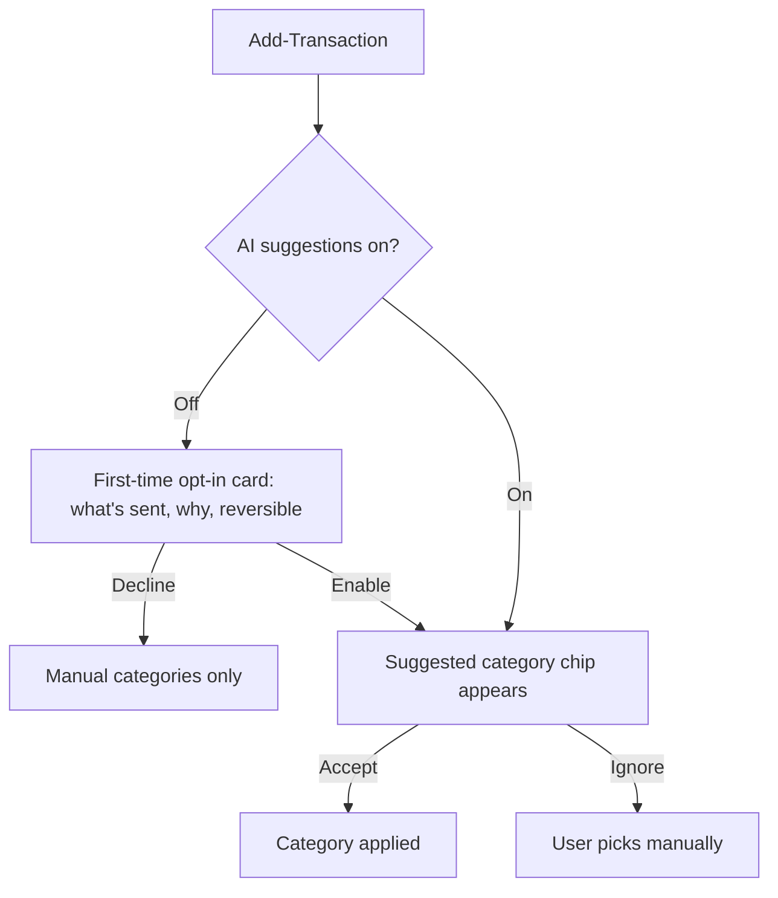

# SmartPocket — UX Design Specification

> Living document produced via the BMAD Create-UX-Design workflow. Grounded in the
> actual codebase (Expo / React Native), not just prior design notes.

## Executive Summary

### Project Vision

SmartPocket is a privacy-conscious, AI-assisted personal finance app that runs from a
single Expo / React Native codebase across iOS, Android, and web. Its promise is **fast
capture, clear insight**: log a transaction in seconds, then understand where the money
went without effort. AI is optional and opt-in; the user stays in control of their data.

The product is delivered in phases — a built MVP (Dashboard, Transactions, Categories,
Insights, Cards) followed by Budgets, Loans, Accounts, an AI assistant, and Settings.
This specification covers the **whole product**: it first establishes a design system to
unify the already-built screens (which currently ship with no design guide), then extends
those patterns to the planned features.

### Target Users

- **Everyday money-trackers** — individuals logging daily income and expenses who want a
  clean, fast, low-friction tool. Moderately tech-savvy; mobile-first, used in short bursts.
- **Privacy-conscious users** — people who want explicit control over their data and any
  AI features, and clear disclosure of how data is used.
- **Informal lenders/borrowers** (later phase) — users tracking personal loans, schedules,
  and repayment reminders.

### Key Design Challenges

1. **No existing design contract.** The five built screens drifted because there was no
   shared system — branding ("Expense Tracker" vs. "SmartPocket"), color, spacing, and
   component styling are inconsistent across screens.
2. **Conflicting color sources of truth.** `design.md` documents a teal `#0a7ea4` system
   while the shipped `theme.config.js` uses indigo `#4F46E5` + rose/violet. One system must win.
3. **Cross-platform parity.** A single codebase must feel native on iOS/Android and sensible
   on web, including dark mode (already tokenized) and one-handed portrait use.
4. **Scaling the IA.** Today's 5 tabs must absorb Settings, Budgets, Loans, and Accounts
   without overcrowding the tab bar.
5. **Money clarity.** Income/expense semantics, signs, and totals must be unmistakable and
   accessible (WCAG AA contrast, ≥44px targets, dynamic type).

### Design Opportunities

1. **One token system** wired to `theme.config.js` (color, type, spacing, radius, elevation)
   → instant cross-screen consistency and dark mode "for free."
2. **A small primitive library** (Screen header, Stat card, List row, Empty state, Pill/Chip,
   Button, Sheet) that every screen composes — eliminating per-screen reinvention.
3. **Signature fast-capture flow** for adding a transaction — the action users perform most.
4. **Trust-forward AI affordances** — opt-in, transparent, reversible — as a differentiator.

### Foundational Design Decision — Color

**Refined Indigo** is the chosen source of truth. Indigo `#4F46E5` reads as trustworthy,
modern, and premium — the direction modern PFM/fintech has converged on — and is already
shipped, minimizing rework. The system is tightened so finance screens stay calm and legible:

- **Indigo** is the single brand/action color.
- **Green / red are strictly semantic** (income / expense, positive / negative) — never used
  for decoration or brand.
- **Rose / violet** are demoted to rare, small accents (e.g., AI/insight highlights).
- `design.md` will be reconciled to match this system; the teal palette is retired.

---

## Core User Experience

### Defining Experience

The defining experience of SmartPocket is **logging a transaction and immediately seeing it
reflected in your balance** — capture-to-clarity in under five seconds. Everything else
(categories, cards, insights, budgets, loans) orbits this loop. The app must make the common
case (add an expense) feel instant and the reflective case (where did my money go?) feel
effortless.

### Platform Strategy

- **Primary platform:** mobile (iOS + Android), portrait, one-handed. The thumb zone (bottom
  third) is reserved for primary actions; the tab bar already lives there.
- **Secondary platform:** web (responsive) — same codebase via Expo. Web is a legitimate
  surface for review/analytics, not a second-class port, but capture is mobile-led.
- **Theming:** light + dark are first-class (already tokenized in `theme.config.js`). Respect
  system color scheme by default with a manual override in Settings.
- **Native feel:** platform-appropriate gestures (swipe actions on rows, sheet modals), haptics
  on confirmations (already wired via `HapticTab`), and safe-area handling (already in
  `ScreenContainer`).

### Effortless Interactions

- **Adding a transaction** — minimum taps: amount → category → save. Date defaults to today;
  type pre-selected from the entry point.
- **Switching months** in Insights — swipe or arrow, no menus.
- **Filtering transactions** — one-tap chips, multi-select, clearable.
- **Reading a number** — color + sign + label make income/expense unmistakable at a glance.

### Critical Success Moments

1. **First transaction** — the empty-state-to-populated transition must feel rewarding.
2. **Month rollover** — Insights should make "this month so far" instantly legible.
3. **AI first suggestion** (planned) — the first accepted category suggestion is the trust moment.
4. **Loan reminder** (planned) — a timely, respectful nudge that prevents an awkward conversation.

### Experience Principles

1. **Capture first, organize later** — never block logging on classification.
2. **Money is sacred, so be honest** — exact figures, clear signs, no dark patterns.
3. **Calm by default** — color restraint; the data is the hero, not the chrome.
4. **Privacy is visible** — AI and data actions are opt-in, explained, and reversible.
5. **Consistency is a feature** — one component does one job everywhere.

---

## Desired Emotional Response

### Primary Emotional Goals

- **In control** — "I know exactly where my money is."
- **Calm, not judged** — the app informs; it never shames spending.
- **Confident & safe** — this app respects my data.

### Emotional Journey Mapping

| Stage           | User feeling (before)            | Target feeling (with SmartPocket) |
| --------------- | -------------------------------- | --------------------------------- |
| Onboarding      | Skeptical, "another finance app" | Quickly oriented, low commitment  |
| First capture   | "Will this be tedious?"          | "That was fast."                  |
| Daily logging   | Chore                            | Habit / quick win                 |
| Reviewing month | Anxious                          | Clear-eyed, in control            |
| Enabling AI     | Wary of privacy                  | Reassured by transparency         |

### Micro-Emotions

- The satisfying _snap_ of a saved transaction (scale + haptic + balance tick).
- The relief of an **empty state** that tells you what to do next, not a dead end.
- The reassurance of a **destructive action** that asks before it bites.

### Design Implications

- Confirmation feedback must be immediate and physical (haptic + micro-animation).
- Negative numbers and over-budget states use red **functionally**, never punitively
  (no scary iconography, no guilt copy).
- Loading and error states are designed, not default — server-backed app means network states
  are common (NFR-3).

### Emotional Design Principles

1. **Reward the habit** — small positive feedback on every capture.
2. **Reduce anxiety** — show progress and context, not just raw totals.
3. **Never surprise with money** — totals and signs are always explicit.

---

## UX Pattern Analysis & Inspiration

### Inspiring Products Analysis

- **Revolut / N26** — indigo/dark premium fintech aesthetic; strong number typography; gradient
  hero cards (we already echo this). Take: confident hierarchy, restrained palette.
- **Copilot / Monarch** — calm analytics, category color systems, monthly review framing. Take:
  insight-first review screens, gentle data viz.
- **YNAB** — budgeting mental model (give every dollar a job). Take: budget-progress patterns
  for the planned Budgets feature.
- **Apple Wallet / Cash App** — fast-capture and card visual metaphors. Take: card UI, sheet-based
  quick actions.

### Transferable UX Patterns

- **Gradient hero summary card** for the dashboard balance (already present — formalize it).
- **Segmented control** for income/expense type.
- **Bottom-sheet modal** for add/edit flows (native, dismissible, thumb-friendly).
- **Filter chips row** for transaction filtering.
- **Category as color+icon token** reused across pickers, rows, and charts.
- **Month stepper** (`‹ May 2026 ›`) for time navigation in Insights.

### Anti-Patterns to Avoid

- Stray/duplicate tabs (the visible `index` tab is a bug to remove).
- Full-width colored "banners" masquerading as buttons (current "Add New Category").
- Overlapping/cramped controls (dashboard quick-action chips clipping the hero card).
- Decorative use of semantic colors (green/red for non-money UI).
- More than 5 primary tabs — overflow goes behind a "More"/Settings entry, not a 6th tab.
- Blocking capture on choosing a category.

### Design Inspiration Strategy

Adopt the premium-fintech _confidence_ (typography, indigo, gradient hero) while staying
_calmer than competitors_ — fewer colors, more whitespace, semantic color discipline.

---

## Design System Foundation

### 1.1 Design System Choice

**NativeWind (Tailwind for React Native) + a thin custom primitive library**, tokenized through
`theme.config.js`. This is already the project's foundation; the work is to formalize tokens and
build the missing shared primitives rather than adopt a new framework.

### Rationale for Selection

- Already installed and used (`tailwind.config.js`, `global.css`, `cn()` util) — zero migration cost.
- `theme.config.js` already centralizes color tokens with light/dark swatches and CSS-variable
  wiring — ideal single source of truth.
- Cross-platform: works for iOS/Android/web from one class API.
- Keeps bundle lean vs. a heavy component kit; we control every primitive.

### Implementation Approach

- Extend `theme.config.js` with **spacing, radius, typography, and elevation** tokens (today it
  only holds colors).
- Build a `components/ui/` primitive set (see Component Strategy) consumed by every screen.
- Replace ad-hoc per-screen styling with these primitives incrementally, screen by screen.

### Customization Strategy

- All design decisions flow through tokens; screens never hardcode hex or px values.
- Category colors live in a dedicated token map (data-driven, user-editable per category).
- Dark mode is automatic via the existing `light:`/`dark:` variant plugin.

---

## 2. Core User Experience (Detailed)

### 2.1 Defining Experience

Capture-to-clarity: a transaction logged from the dashboard appears in Recent Activity and
updates the balance hero without a full reload, reinforcing the cause→effect of spending.

### 2.2 User Mental Model

Users think in **"money in / money out, sorted into buckets."** The app mirrors this:
Transactions (the ledger), Categories (the buckets), Insights (the summary), Cards/Accounts
(where the money lives), Budgets (limits on buckets), Loans (money owed/lent).

### 2.3 Success Criteria

- Add-expense flow completable in ≤ 3 taps + amount entry, < 5 seconds.
- Dashboard balance and recent activity load < 1s after data fetch (NFR-2).
- Zero ambiguity on whether a number is income or expense (tested with color-blind simulation).

### 2.4 Novel UX Patterns

- **Inline AI category suggestion** (planned): a non-blocking suggested chip above the category
  grid in add-transaction; one tap accepts, ignore to pick manually. Trust-forward: shows it's a
  suggestion, never auto-applies silently.
- **Natural-language insight prompt** (planned): a single ask-bar on Insights ("Top expenses last
  month?") that returns a focused answer card.

### 2.5 Experience Mechanics

- Entry points to add-transaction: dashboard "Add Income"/"Add Expense" (type pre-selected),
  and a global affordance. Both open the same sheet.
- Optimistic UI on save (TanStack Query) with rollback on error and a non-blocking error toast.
- Category picker is a scrollable grid of color+icon tokens; recently-used float to the front.

---

## Visual Design Foundation

### Color System

Tokens (light / dark) — formalized from `theme.config.js`:

| Token        | Light     | Dark      | Role                                                 |
| ------------ | --------- | --------- | ---------------------------------------------------- |
| `primary`    | `#4F46E5` | `#818CF8` | Brand, primary actions, active states                |
| `background` | `#F8FAFC` | `#0B0F19` | App background                                       |
| `surface`    | `#FFFFFF` | `#151B2B` | Cards, sheets, elevated surfaces                     |
| `foreground` | `#111827` | `#F1F5F9` | Primary text                                         |
| `muted`      | `#6B7280` | `#9CA3AF` | Secondary text, inactive icons                       |
| `border`     | `#E5E7EB` | `#2D3748` | Dividers, outlines                                   |
| `success`    | `#059669` | `#34D399` | **Income / positive (semantic only)**                |
| `error`      | `#DC2626` | `#FCA5A5` | **Expense / negative / destructive (semantic only)** |
| `warning`    | `#D97706` | `#FBBF24` | Alerts, over-budget, due-soon                        |
| `accent`     | `#DB2777` | `#F472B6` | Rare small accents (AI/insight highlights)           |
| `secondary`  | `#7C3AED` | `#A78BFA` | Hero gradient end-stop, rare accents                 |

- **Hero gradient:** `primary → secondary` (indigo → violet), used only on the dashboard balance card.
- **Semantic discipline:** `success`/`error` are reserved for money & destructive actions; never decorative.
- **Category palette:** a separate, data-driven token set (each category owns a color+icon). Defaults
  should be tuned for WCAG AA on both surfaces.

### Typography System

System font stack (already defined in `lib/_core/theme.ts` `Fonts`): `system-ui` / SF Pro on iOS,
Roboto on Android, system stack on web. A type scale:

| Token     | Size / Line | Weight | Use                                               |
| --------- | ----------- | ------ | ------------------------------------------------- |
| `display` | 32 / 38     | 700    | Balance hero amount                               |
| `h1`      | 28 / 34     | 700    | Screen titles                                     |
| `h2`      | 22 / 28     | 600    | Section titles                                    |
| `h3`      | 18 / 24     | 600    | Card titles                                       |
| `body`    | 16 / 24     | 400    | Default text                                      |
| `label`   | 14 / 20     | 500    | Field labels, chips                               |
| `caption` | 12 / 16     | 400    | Timestamps, hints                                 |
| `number`  | tabular     | 600    | All monetary figures (tabular-nums for alignment) |

- Monetary values use **tabular figures** so columns of money align.
- Support Dynamic Type / font scaling up to 200% (NFR-5).

### Spacing & Layout Foundation

4-pt base scale (to be added as tokens):

| Token | px  | Use                          |
| ----- | --- | ---------------------------- |
| `xs`  | 4   | icon/text gaps               |
| `sm`  | 8   | tight gaps                   |
| `md`  | 12  | default gap                  |
| `lg`  | 16  | screen padding, card padding |
| `xl`  | 20  | generous section spacing     |
| `2xl` | 24  | screen-level separation      |

Radius: `sm 8` · `md 12` (default) · `lg 16` (cards) · `full` (pills/chips).
Elevation: subtle, low-opacity shadows (matching the tab bar's `shadowOpacity 0.04`); dark mode
relies on `surface` lightness rather than heavy shadows.

### Accessibility Considerations

- WCAG 2.1 AA contrast for all text/UI on both themes (verify category colors especially).
- Touch targets ≥ 44×44 pt.
- Never encode meaning in color alone — pair income/expense color with sign (`+`/`−`) and/or icon.
- Screen-reader labels on every interactive element; charts have text-equivalent summaries.

---

## Design Direction Decision

### Design Directions Explored

1. **Refined Indigo (Premium Fintech)** — current base, formalized: indigo brand, gradient hero,
   calm surfaces, semantic green/red. Modern, distinctive, low rework.
2. **Calm Teal (Trust/Health)** — the retired `design.md` direction: teal brand, flatter cards.
   Calmer but generic and high rework.
3. **Neutral Mono + Accent** — near-monochrome with a single accent; maximally calm but risks
   feeling sterile for a consumer app.

### Chosen Direction

**Direction 1 — Refined Indigo.** It best fits a privacy-conscious, modern audience and the PFM
industry, builds on what's shipped, and — with tightened semantic color rules — stays calm.

### Design Rationale

Maximizes brand distinctiveness and trust signaling while minimizing migration cost; the discipline
added (semantic color reservation, token system) resolves the very inconsistencies that prompted
this spec.

### Implementation Approach

Tokenize → build primitives → retrofit screens in priority order (Dashboard → Add Transaction →
Activity → Categories → Insights → Cards), then apply the same primitives to planned features.

---

## User Journey Flows

### Journey 1 — Add an Expense (signature flow)

```mermaid
flowchart TD
    A[Dashboard] -->|Tap "Add Expense"| B[Add-Transaction sheet, Expense preselected]
    B --> C[Enter amount]
    C --> D[Pick category from grid]
    D --> E{Link a card?}
    E -->|Yes| F[Select card]
    E -->|No| G[Optional note + date]
    F --> G
    G --> H[Tap Save]
    H --> I[Optimistic update + haptic]
    I --> J[Sheet closes; balance + Recent Activity update]
    H -.->|Network error| K[Toast + rollback, sheet stays]
```

### Journey 2 — Review the Month

```mermaid
flowchart TD
    A[Insights tab] --> B[Current month summary: income / expense / net]
    B --> C[Category breakdown chart]
    C -->|Tap a category| D[Filtered transactions for that category]
    B -->|Swipe / arrows| E[Previous / next month]
    B -->|Ask-bar (planned)| F[NL query → answer card]
```

### Journey 3 — Enable AI Categorization (planned, trust moment)



### Journey Patterns

- **Sheet-based create/edit** for all entities (transaction, category, card, budget, loan).
- **Drill-down via tap** from summary → filtered list → detail.
- **Time navigation via stepper/swipe** wherever a period is shown.

### Flow Optimization Principles

- Pre-fill everything that can be inferred (type, date, last-used card).
- Make the primary action the largest, lowest (thumb-reachable) control.
- Every destructive step is confirmable and, where possible, undoable.

---

## Component Strategy

### Design System Components

Built on NativeWind primitives + existing `components/` (`ScreenContainer`, `HapticTab`,
`ThemedView`, `IconSymbol`, `Collapsible`). These stay; we add a consistent `components/ui/` layer.

### Custom Components

#### ScreenHeader

**Purpose:** Consistent screen title + subtitle + optional trailing action.
**Usage:** Top of every tab/screen, replacing per-screen header markup.
**Anatomy:** Title (`h1`), optional subtitle/count (`caption`/`muted`), optional right-aligned action.
**States:** default, with-action, with-back.
**Accessibility:** Title is a heading; action has a label.
**Content Guidelines:** Title = noun ("Transactions"); subtitle = count/context ("12 this month").

#### StatCard

**Purpose:** Display a single financial figure with label and trend.
**Usage:** Dashboard summary, Insights totals.
**Anatomy:** Label (`label`), value (`number`/`display`), optional delta + icon.
**States:** positive (success), negative (error), neutral, loading (skeleton).
**Variants:** hero (gradient, balance), compact (income/expense pair).
**Accessibility:** Value announced with sign + currency; color never the sole signal.

#### TransactionRow

**Purpose:** One ledger entry in a list.
**Anatomy:** Leading category color+icon avatar, title + date, trailing signed amount.
**States:** default, pressed (opacity 0.7), swipe-revealed (edit/delete), selected.
**Variants:** with-card-badge, with-note.
**Interaction:** tap → detail/edit sheet; swipe → edit/delete with confirm on destructive.
**Accessibility:** Single focusable element summarizing "Expense, Food, May 16, minus $25.50."

#### CategoryToken / CategoryPickerGrid

**Purpose:** Reusable color+icon category chip and its selection grid.
**Usage:** Category screen, add-transaction picker, chart legends, filters.
**States:** default, selected (ring in `primary`), disabled.
**Accessibility:** Labeled by category name; selected state announced.

#### Pill / FilterChip

**Purpose:** Single-tap filter/segment.
**Anatomy:** Label, optional count, optional leading icon; pill radius (`full`).
**States:** default, active (`primary` fill, on-primary text), disabled.
**Variants:** filter (multi-select), segment (single-select group e.g. income/expense).
**Fixes:** replaces the inconsistent Activity filter chips and the misused "Add New Category" banner.

#### Button

**Purpose:** The one button primitive.
**Variants:** primary (indigo fill), secondary (surface + border), ghost (text), destructive (error),
income (success — only for the income quick action), icon-only.
**States:** default, pressed (scale 0.97 + haptic), disabled, loading (spinner, label retained).
**Accessibility:** ≥44pt height; label or accessibilityLabel required.

#### Sheet (BottomSheetModal)

**Purpose:** Container for all create/edit flows.
**States:** entering (fade+slide-up 250ms), open, dismissing; handles keyboard avoidance + safe area.
**Accessibility:** Focus trap, dismiss affordance, announced as modal.

#### EmptyState

**Purpose:** Designed zero-data state.
**Anatomy:** Icon, title, supportive line, primary action.
**Usage:** Empty transactions, categories, cards, search results (already present — standardize).

#### Skeleton / Loader & Toast

**Purpose:** Network-state feedback for a server-backed app (NFR-3).
**Usage:** Skeletons on first load; toast for success/error after mutations.

### Component Implementation Strategy

- Land tokens first, then build primitives bottom-up (Button, Pill, StatCard, TransactionRow…).
- Each primitive is theme-token-driven, fully typed, and has light/dark + a11y baked in.
- Retrofit one screen at a time, deleting ad-hoc styles as primitives replace them.

### Implementation Roadmap

1. **Tokens** — extend `theme.config.js` (spacing, radius, type, elevation) + category color map.
2. **Primitives** — `Button`, `Pill`, `ScreenHeader`, `StatCard`, `TransactionRow`, `EmptyState`,
   `Sheet`, `CategoryToken`, `Skeleton`, `Toast`.
3. **Retrofit built screens** — Dashboard → Add-Transaction → Activity → Categories → Insights → Cards
   (also: remove stray `index` tab, fix dashboard chip overlap, fix "Add New Category" button).
4. **Planned features** — compose the same primitives for Settings, Budgets, Loans, Accounts, AI.

---

## UX Consistency Patterns

### Button Hierarchy

- **Primary (indigo fill):** one per screen/section — the main action (Save, Add).
- **Secondary (surface + border):** alternative actions (Cancel, secondary nav).
- **Ghost (text):** low-emphasis ("View All", inline links).
- **Destructive (error):** delete/remove — always paired with confirmation.
- **Semantic income (success):** reserved for the "Add Income" quick action only.

### Feedback Patterns

- **Press:** scale 0.97 + light haptic (already the convention).
- **Success:** toast + success haptic; the affected number animates to its new value.
- **Error:** non-blocking error toast + error haptic; optimistic change rolls back.
- **Loading:** skeletons for screen loads; in-button spinner for mutations (label retained).
- **Destructive confirm:** sheet/alert with explicit consequence text.

### Form Patterns

- Sheet-based forms; labels above fields (`label` token); amount field is large and focused first.
- Validation inline, on blur and on submit; Save disabled until valid (e.g., amount > 0).
- Smart defaults (today's date, type from entry point, last-used card).
- Keyboard: numeric pad for amounts; sheet avoids keyboard overlap.

### Navigation Patterns

- **Tab bar (max 5):** Home, Activity, Categories, Insights, Cards (current). Settings, Budgets,
  Loans, Accounts route from Home/Settings, **not** new tabs. Remove the stray `index` tab.
- **Drill-down:** summary → filtered list → detail/edit sheet; back returns to prior context.
- **Time navigation:** month stepper + horizontal swipe, consistent across Insights/reports.

### Additional Patterns

- **Empty states:** icon + title + one supportive line + primary action — never a blank screen.
- **Lists:** grouped by date where temporal (Today / Yesterday / This Week), with sticky headers.
- **Currency display:** symbol + tabular figures + explicit sign; respects user's currency setting.
- **Color-blind safety:** sign and/or icon always accompany income/expense color.

---

## Responsive Design & Accessibility

### Responsive Strategy

- **Mobile-first**, single-column, thumb-zone primary actions. This is the canonical layout.
- **Web/tablet:** content max-width with centered column on phones-rendered routes; on wide
  viewports, promote to a two-pane layout (list + detail) for Activity and Insights rather than
  stretching single-column content.
- Avoid fixed pixel widths; let NativeWind flex utilities drive fluid layout.

### Breakpoint Strategy

| Breakpoint | Width  | Layout                                                                |
| ---------- | ------ | --------------------------------------------------------------------- |
| `base`     | < 640  | Single column, bottom tab bar (mobile)                                |
| `md`       | ≥ 768  | Wider padding, optional two-column cards                              |
| `lg`       | ≥ 1024 | Two-pane (master/detail) on web for lists + detail; side nav optional |

### Accessibility Strategy

- Target **WCAG 2.1 AA**: contrast, focus visibility, text alternatives.
- Touch targets ≥ 44pt; spacing prevents mis-taps.
- Full screen-reader support (VoiceOver/TalkBack) with meaningful labels and grouped rows.
- Dynamic Type up to 200%; layouts must not clip or truncate critical figures.
- Respect reduced-motion: disable non-essential animation when the OS flag is set.
- Color independence: never rely on hue alone for income/expense/over-budget meaning.

### Testing Strategy

- Contrast audit of all tokens incl. category colors on both themes.
- Screen-reader pass on each screen's primary flow.
- Color-blind simulation (deuteranopia/protanopia) on money-bearing screens.
- Dynamic Type and reduced-motion smoke tests.
- Cross-platform visual check: iOS, Android, web (light + dark).

### Implementation Guidelines

- Bake a11y into primitives (labels, roles, min sizes) so screens inherit it by default.
- Lint/PR checklist item: no hardcoded hex/px (tokens only), every interactive element labeled.
- Keep `ScreenContainer` as the safe-area boundary; never place actions under the home indicator.
